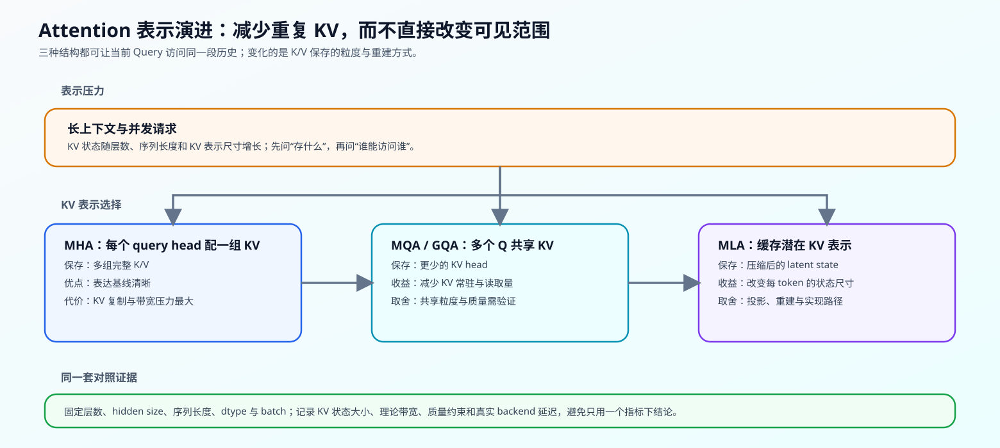

# 04 Attention 表示与 KV Cache 演进（Attention Representation Evolution）

## 页面导语

长上下文模型首先会遇到一个很具体的问题：每生成一个 token，模型要为历史保留什么状态。MHA、MQA、GQA 和 MLA 都仍属于 Attention 路径，但它们用不同粒度保存 K/V，因此会改变每个 token 的状态大小、读取带宽与实现复杂度。

本页是 Task1 的机制页：关注 **KV 如何表示**。位置如何进入 Q/K、哪些历史 token 可见，留给 Task3；不再保存完整 token 级历史时如何递推，留给 Task5。

## 1. 设计压力：完整 KV 表示为何会成为问题

标准自回归 Attention 为每一层、每个历史 token 保存 K/V。长度、层数、KV head 数、head dimension、batch 与 dtype 共同决定这份状态的体积。上下文变长或并发请求增多时，问题不只是计算量，还包括常驻状态与读取带宽是否限制 batch。

| 要固定的比较条件 | 观察的对象 | 不能忽略的原因 |
|:---|:---|:---|
| 层数、hidden size、head dimension | 单层 KV 的表示尺寸 | 否则不同模型规模会掩盖结构差异 |
| 序列长度、batch、生成长度 | 历史状态的增长 | KV Cache 是随请求生命周期增长的状态 |
| dtype、backend、硬件 | 实际显存与延迟 | 理论字节数不等于真实执行代价 |
| 任务质量约束 | 共享或压缩后的输出质量 | 状态更小不自动表示可用 |

## 2. 结构机制：从复制 KV 到共享或压缩表示

下表只比较 K/V 的保存方式。三种方案都可以在同样的因果 mask 下访问历史；“能访问哪些 token”是局部、窗口和稀疏 Attention 的问题，而不是这里的 head 共享问题。

| 结构 | 保存的状态 | 结构变化 | 主要收益 | 需要验证的取舍 |
|:---|:---|:---|:---|:---|
| MHA | 每个 attention head 的完整 K/V | Q、K、V head 数相同 | 表达基线明确 | KV 状态与带宽随 head 数增加 |
| MQA | 一组共享 K/V | 所有 Q head 读取同一组 K/V | 最大幅度减少 KV 复制 | 共享过强时的质量风险 |
| GQA | 少量共享 KV group | 多个 Q head 对应一个 KV group | 在状态成本与质量间折中 | group 数需要随模型和任务验证 |
| MLA | 压缩后的 latent KV | 保存 latent state，再按需要参与注意力 | 改变每个 token 的状态表示尺寸 | 投影、重建和 backend 支持带来额外路径 |

可将这条演进理解为两类动作：MQA/GQA 通过“**少存几组 KV**”减少复制；MLA 通过“**把每组 KV 存得更小**”改变表示。两者都不等于限制可见范围。

## 3. 取舍与证据：结构账本不能替代真实模型结论

先用同一组结构参数计算理论状态账本，再决定是否做真实模型比较。对于同家族、训练和实现条件可比的变体，可以讨论相对取舍；对于不同公开 checkpoint，只能将结果记为跨模型观察，不能把差异归因于某一个 Attention 改动。

| 证据层级 | 可以回答的问题 | 典型入口 |
|:---|:---|:---|
| 理论账本 | MHA/GQA/MLA 的 KV 表示为何随长度、head 数变化 | [Part 02 · 04 MHA / GQA](../../02_PyTorch_Algorithms/04_Attention_MHA_GQA.md)、[Part 02 · 71 MLA / KV Cache 结构基准](../../02_PyTorch_Algorithms/71_MLA_KV_Cache_Architecture_Benchmark.md) |
| CPU 机制验证 | head 共享、latent / 位置分量和配置契约是否正确 | [Part 02 · 04](../../02_PyTorch_Algorithms/04_Attention_MHA_GQA.md)、[ARCH-MLA](../../02_PyTorch_Algorithms/ARCH-MLA_Multihead_Latent_Attention.md) |
| GPU / backend 观察 | 真实显存、TTFT、TPOT、吞吐是否改变 | 推理优化与性能优化的对应 benchmark |
| 质量对照 | 状态压缩是否保留目标任务能力 | 同家族变体或明示为跨模型观察的长度阶梯 |

## 4. 代码与项目入口

代码练习应先让学习者计算不同 head / KV head / latent dimension 下的状态账本，再用输入契约和边界用例验证分组关系。真实 backend 测量必须记录模型 revision、dtype、上下文长度、batch 与 backend，才能把理论账本与实际结果并排解释。

| 入口 | 验证责任 | 学习者应留下的证据 |
|:---|:---|:---|
| [Part 02 · 04 Attention（MHA / GQA）](../../02_PyTorch_Algorithms/04_Attention_MHA_GQA.md) | Q/K/V head 的形状、分组与 KV 账本 | 分组正确性、状态公式与边界测试 |
| [Part 02 · 71 MLA / KV Cache 结构基准](../../02_PyTorch_Algorithms/71_MLA_KV_Cache_Architecture_Benchmark.md) | MHA、GQA、MLA 的表示账本与对照协议 | baseline/candidate、evidence level 与决策 |
| [ARCH-MLA 机制页](../../02_PyTorch_Algorithms/ARCH-MLA_Multihead_Latent_Attention.md) | latent state、位置分量与读取路径 | 配置、状态字节数与表示不变量 |
| [推理优化](../inference_optimization/intro.md) | 将 KV 表示放入请求生命周期 | Cache 管理、TTFT、TPOT 与吞吐 |
| [性能优化](../performance_optimization/intro.md) | 检查状态、带宽与实现开销 | 显存、profile 与成本证据 |

## 相关阅读

- [Attention Is All You Need](https://arxiv.org/abs/1706.03762)：多头 Attention 的基线。
- [Fast Transformer Decoding: One Write-Head is All You Need](https://arxiv.org/abs/1911.02150)：MQA 的原始动机。
- [GQA: Training Generalized Multi-Query Transformer Models from Multi-Head Checkpoints](https://arxiv.org/abs/2305.13245)：GQA 的共享粒度与训练入口。
- [DeepSeek-V2](https://arxiv.org/abs/2405.04434)：MLA 的代表架构案例。
- [Part 02 · 44 局部、滑动窗口与稀疏 Attention](../../02_PyTorch_Algorithms/44_Local_Sliding_and_Sparse_Attention.md)：继续学习“哪些历史 token 可访问”。
- [Part 02 · 45 线性 Attention 与递推状态](../../02_PyTorch_Algorithms/45_Linear_Attention_and_Recurrent_State.md)：继续学习“不保存完整历史时怎样递推”。
