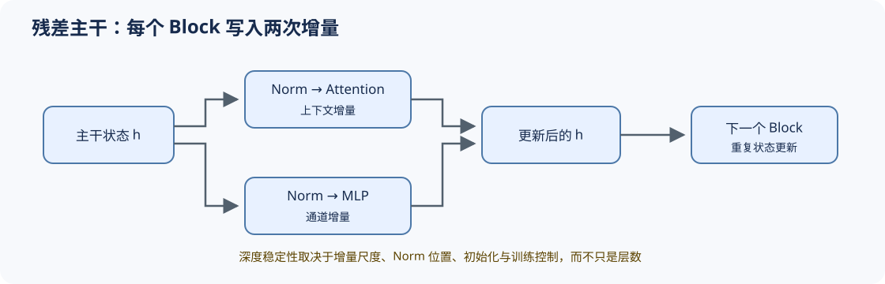

# 06 Block 与残差主干（Block and Residual Stream）

## 页面导语

单个算子并不能解释模型深度。Decoder Block 通过残差流把 Attention 与 MLP 的增量写回主干；Norm 位置、分支尺度和层数共同决定状态能否稳定传播。本页关注“多个 Block 如何连续更新”，而不是重复介绍各个组件公式。

## 1. 设计压力：为什么需要一条稳定的主干状态？

如果每个子层都直接覆盖 hidden state，深层模型难以保留已有信息，也更容易出现梯度衰减或放大。残差流让子层学习增量更新，Pre-Norm 则在分支读取主干前控制尺度。

## 2. 结构机制：一个 Block 是两次受控状态更新

| 阶段 | 主干状态变化 | 关键约束 |
|:---|:---|:---|
| Attention 更新 | `h ← h + Attention(Norm(h))` | 上下文访问、位置机制、Attention 表示 |
| MLP 更新 | `h ← h + MLP(Norm(h))` | 通道扩张、门控激活、Dense 或 MoE |
| 多层堆叠 | 重复两次增量更新 | 残差尺度、深度、初始化和数值范围 |

## 3. 取舍与证据：深度增加不保证有效容量增加

Block 变体要同时检查结构合法性、参数量/FLOPs、激活与梯度尺度、训练稳定性和目标任务质量。残差缩放或额外 Norm 只有在相同训练口径下，才能形成较强的稳定性证据。

## 4. 代码与项目入口

- [Part 00 · 13 Transformer Block 数据流](../../00_Prerequisites/13_Transformer_Block_Dataflow_and_Residual_Stream.md)：建立组件到 Block 的映射。
- [Part 02 · 05 LLaMA3 Block](../../02_PyTorch_Algorithms/05_LLaMA3_Block_Tutorial.md)：实现两条残差更新。
- [Part 02 · 08 架构技巧](../../02_PyTorch_Algorithms/08_Architecture_Tricks.md)：读取配置并审计参数归属。
- [Part 02 · 60 Decoder Block 稳定性项目](../../02_PyTorch_Algorithms/60_Decoder_Block_Stability_Benchmark.md)：比较 Block 变体。

## 相关阅读

- [On Layer Normalization in the Transformer Architecture](https://arxiv.org/abs/2002.04745)
- [DeepNet](https://arxiv.org/abs/2203.00555)
- [LLaMA](https://arxiv.org/abs/2302.13971)
