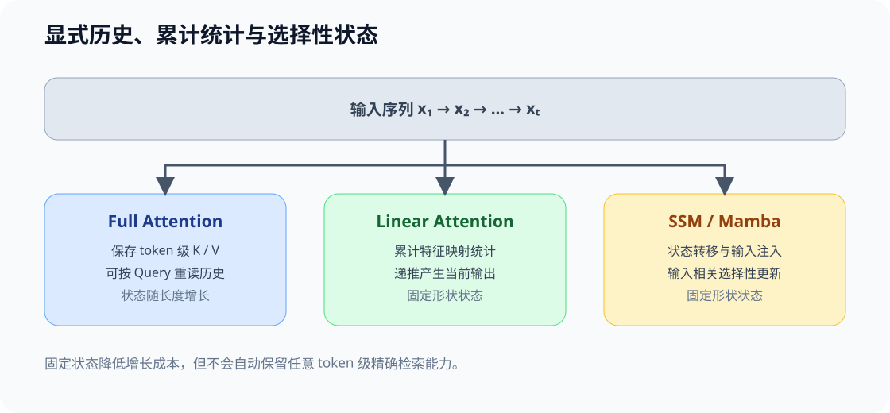

# 10 线性 Attention、SSM 与混合记忆（Linear Attention, SSM, and Hybrid Memory）

## 页面导语

本页讨论另一类长序列结构选择：不再为每个历史 token 保留可随机读取的完整 KV，而是把历史压缩成固定形状、按序更新的状态。重点不是把 SSM 当作 Attention 的别名，而是比较两类记忆在状态大小、并行条件、检索能力和长序列代价上的不同。

本页的输出是一张混合架构判断表：知道何时仍需要全 Attention，何时可以用线性或状态空间层承担局部、长程或低成本记忆，以及怎样把这个判断写回模型审计卡。

## 1. 设计压力：完整历史为什么会成为结构约束？

标准 Attention 为每个历史位置保留 K/V，并在当前位置用 Query 检索它们。这个设计擅长内容寻址和任意位置交互，但状态会随序列长度增长，训练阶段还会面对大规模 token 间计算。

当目标是更长序列或更低状态成本时，结构选择不只有“减少 KV head”或“限制可见窗口”两种。另一条路线是：把历史折叠为状态 `s_t`，让下一个状态由当前输入和前一状态递推得到。

## 2. 结构机制：两类记忆接口

| 记忆接口 | 保存什么 | 当前 token 如何利用历史 | 主要优势 | 主要代价 |
|:---|:---|:---|:---|:---|
| 显式 KV 历史 | 每个历史 token 的 K/V | Query 对历史 K/V 做内容相关检索 | 任意位置访问直观，适合复杂检索关系 | 状态随长度增长；Attention 计算和访存压力高 |
| 局部 / 稀疏访问 | 部分历史 K/V 或选中的块 | 只读取窗口、块或检索到的历史 | 降低访问范围和理论连接数 | 可能遗漏窗口外或未选中的信息 |
| 线性 Attention / SSM 状态 | 固定形状的累计或选择性状态 | 递推更新 `s_t`，再由 `s_t` 产生输出 | 状态不随序列线性增长，适合长序列扫描 | 难以完全复现任意历史 token 的随机检索 |

Part 02 · [45 线性 Attention 与递推状态](../../02_PyTorch_Algorithms/45_Linear_Attention_and_Recurrent_State.md) 建立累计状态基础，[ARCH-HYBRID-MEMORY](../../02_PyTorch_Algorithms/ARCH-HYBRID-MEMORY_Attention_SSM_Hybrid.md) 再检查 SSM 与 Attention 的层级分工；真实模型的质量与成本由长度阶梯对照记录。

## 3. 取舍与证据：从线性 Attention 到选择性状态空间

线性 Attention 与 SSM 的共同点是避免显式构造全部 token 两两关系，但状态来源不同：

- 线性 Attention 通常把历史 K/V 聚合为可递推的统计量，使 Query 能通过特征映射读取该聚合状态；
- SSM 用状态转移和输入注入更新内部状态，选择性机制再让不同输入以不同方式影响状态；
- 两者都把“保存全部历史”改写为“维护一个状态”，却不保证与全 Attention 完全等价。

因此审计一个“线性”或“状态空间”模型时，至少要问：状态形状是否固定、哪些输入会写入状态、是否仍保留 Attention 层作为全局检索出口，以及训练与推理是否采用相同的扫描/并行路径。

## 4. 真实模型对照协议

Task5 不能把一个标准 Attention checkpoint、一个 SSM checkpoint 和一个混合模型的数字直接写成“同一架构改动的收益”。它们往往训练数据、规模、tokenizer、训练长度和实现路径都不同。更合适的做法是先声明对照类型，再分别阅读质量与成本证据。

| 对照组 | 记忆接口 | 可以回答的问题 | 不能直接推出的结论 |
| --- | --- | --- | --- |
| 显式 KV Attention | 每个历史 token 的 K/V | 长度增长时状态、prefill 与 decode 怎样变化 | 它一定比递推状态质量更好或更差 |
| 线性 Attention / SSM | 固定形状的累积或选择性状态 | 状态不随 token 线性增长时，成本和长依赖质量怎样取舍 | 与另一模型的差异完全由记忆接口造成 |
| 混合架构 | Attention 层与递推层分工 | 哪些层保留全局读取、哪些层改为递推，端到端收益是否值得 | 混合比例可以从单项指标直接推导 |

### 两种证据等级

| 比较设计 | 前提 | 可形成的结论 | 结果标签 |
| --- | --- | --- | --- |
| 同家族变体（`same_family_variant`） | 模型规模、数据、训练长度和实现大致可比，只改变或明确隔离记忆接口 | 可讨论候选结构在该家族中的相对取舍 | 近似结构对照 |
| 跨模型观察（`cross_model_observational`） | 使用不同公开 checkpoint | 可用于部署选型与假设生成 | 观察性证据，不做单因素归因 |

### 固定 workload 与报告字段

真实对照至少使用短、中、长三个长度档；每档固定 prompt 模板、batch、生成长度、dtype、backend 与硬件。先记录 prompt 所在的训练长度内外，再同时报告质量、状态和服务成本。

| 分区 | 最少记录 | 为什么需要它 |
| --- | --- | --- |
| `provenance` | 模型、revision、tokenizer、dtype、backend、硬件 | 避免把版本或实现差异隐藏在模型名后面 |
| `architecture` | Attention/SSM/混合类型、KV heads、状态表示、层分布 | 明确比较的记忆接口是什么 |
| `quality` | 任务集、训练/评测长度、长距离检索、失败样例 | 避免只报告速度而忽略远程信息损失 |
| `cost` | prefill、TPOT、吞吐、峰值显存、KV/state memory、batch | 解释长度增长究竟暴露在哪个阶段 |
| `evidence` / `decision` | evidence level、failure、accept/tune/reject | 使结论能回到可检查证据 |

Part 02 · [61 模型架构探索](../../02_PyTorch_Algorithms/61_Model_Architecture_Exploration.md) 已提供这套 JSON 分区和最小 GPU 审计入口：它先跑单 prompt 的 needle smoke，再决定是否进入独立任务集与长度阶梯。Part 02 · [77 长序列记忆架构基准](../../02_PyTorch_Algorithms/77_Long_Sequence_Memory_Architecture_Benchmark.md) 承接专项对照：模型候选、许可证和 GPU 预算仍需在配置中明确，且必须区分同家族变体对照与跨模型观察。

## 5. 混合架构：把不同记忆职责放进不同层

纯 Attention、纯递推与混合架构不是简单的性能排名。更常见的设计是把层分工：

| 设计 | 适合承担的职责 | 需要继续验证的风险 |
|:---|:---|:---|
| 全 Attention 主干 | 内容相关的全局检索、复杂上下文交互 | 长上下文状态和访存成本 |
| 局部 / 稀疏 Attention | 近邻模式或受控的远程访问 | 访问策略是否遗漏关键信息 |
| SSM / 递推层 | 低成本长序列状态更新、流式扫描 | 固定状态是否保留任务需要的信息 |
| Attention + SSM 混合 | 让部分层保留全局检索，部分层承担状态递推 | 层排列、接口切换和质量收益是否值得复杂度 |

这条线与 Task1、Task3 相连：Task1 讨论显式 KV、head 与 latent 表示；Task3 讨论位置、长度外推与仍保存 token 历史时的访问范围；Task5 则讨论模型不再保存完整历史时，记忆接口本身如何改变。

## 6. 代码、项目与审计入口

- [Part 02 · 44 局部、滑动窗口与稀疏 Attention](../../02_PyTorch_Algorithms/44_Local_Sliding_and_Sparse_Attention.md)：比较“仍保存 KV，但只让谁看谁”。
- [Part 02 · 45 线性 Attention 与递推状态](../../02_PyTorch_Algorithms/45_Linear_Attention_and_Recurrent_State.md)：比较“保存完整历史”与“递推压缩状态”。
- [ARCH-HYBRID-MEMORY](../../02_PyTorch_Algorithms/ARCH-HYBRID-MEMORY_Attention_SSM_Hybrid.md)：把 Attention / SSM 的层级安排、状态账本和历史访问条件变成可测试机制。
- [Part 02 · 61 模型架构探索](../../02_PyTorch_Algorithms/61_Model_Architecture_Exploration.md)：把注意力、记忆与 FFN 替换登记为候选结构，再按资源、质量和证据等级判断是否继续验证。
- [Part 02 · 77 长序列记忆架构基准](../../02_PyTorch_Algorithms/77_Long_Sequence_Memory_Architecture_Benchmark.md)：在固定长度阶梯记录显式 KV、递推状态或混合模型的质量与成本证据。

## 结构审计问题

面对一个混合架构，建议按下面顺序记录，而不是只标注“用了 Mamba”或“用了线性 Attention”：

1. 这层保存的是完整 KV、受限 KV，还是固定大小状态？
2. 当前 token 能否内容相关地访问任意历史位置？若不能，采用什么状态更新替代？
3. 全局检索由哪些 Attention 层承担，递推层放在什么位置？
4. 状态成本、训练并行条件、长序列质量分别需要什么证据？
5. 结论是结构假设、CPU 机制验证，还是已在目标 workload 上完成真实 benchmark？

## 相关阅读

- [Mamba: Linear-Time Sequence Modeling with Selective State Spaces](https://arxiv.org/abs/2312.00752)：选择性状态空间模型的代表入口。
- [Transformers are SSMs: Generalized Models and Efficient Algorithms Through Structured State Space Duality](https://arxiv.org/abs/2405.21060)：从结构对偶理解 Attention 与状态空间模型。
- [Part 02 · 45 线性 Attention 与递推状态](../../02_PyTorch_Algorithms/45_Linear_Attention_and_Recurrent_State.md)：先运行状态账本，再回到本页比较架构含义。
