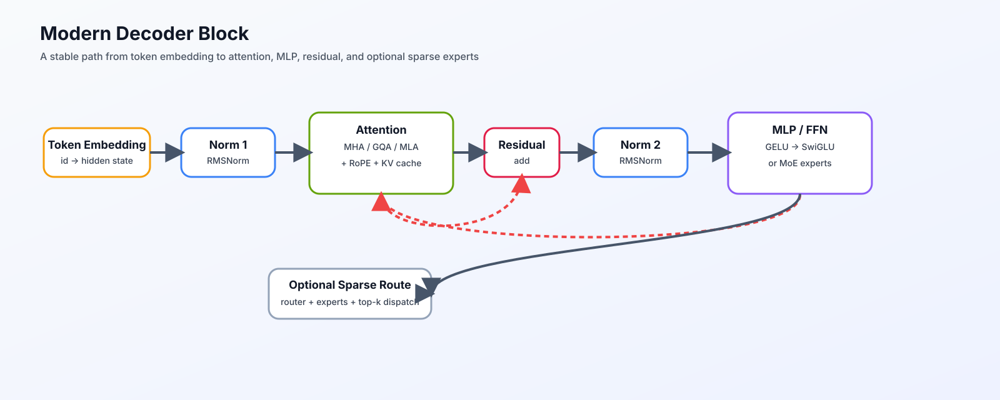
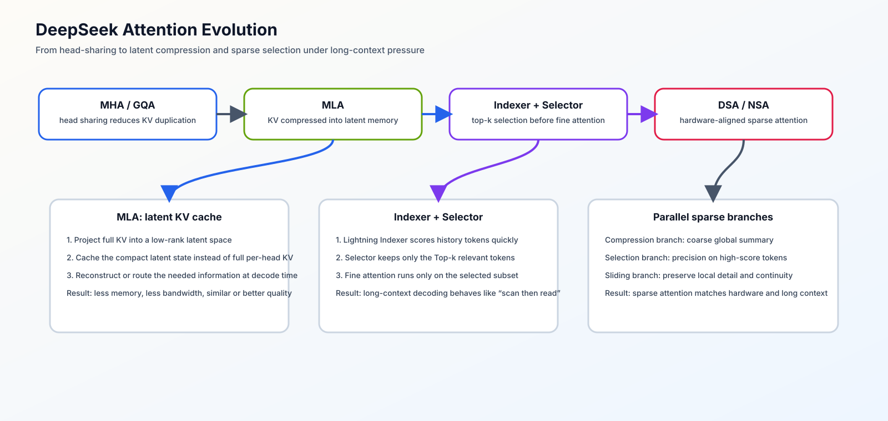
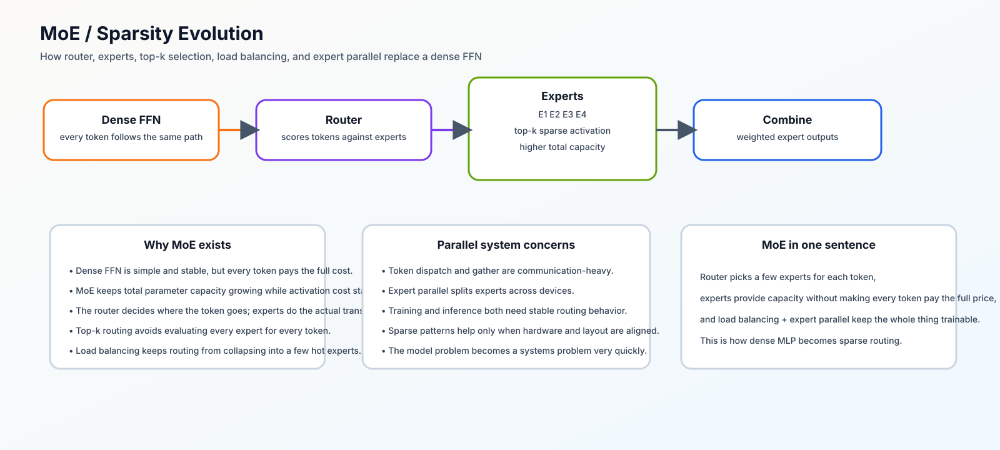
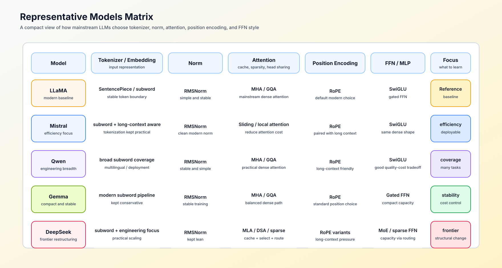

# 架构演进问题链：从 Block 到模型审计

这条问题链把“我看不懂一个新模型改了什么”拆成可连续回答的六个问题。每一段都产出下一段需要的结构证据，而不是按模型名称罗列特性。

先用总览图定位问题所在的结构层，再沿下面的问题链阅读；图中的箭头表示阅读与审计依赖，不代表某个结构一定优于另一个结构。

## 1. 输入如何成为可计算状态？

先确认 token、embedding、位置和 hidden size：输入张量的形状是什么，位置在哪个位置进入，输出 head 是否与 embedding 共享权重。对应 [01 Transformer Decoder](./01_transformer_decoder.md) 与 [02 Tokenization / Embedding](./02_tokenization_embedding.md)。

**产出：** 一条 `token id → hidden state → logits` 的形状与参数归属记录。

## 2. 一个 Block 如何保留并更新主干状态？

再沿 residual path 看 Pre-Norm / Post-Norm、Attention 分支与 MLP 分支的顺序。此处不先讨论某个变体是否更快，而是确认每个子层读写哪份 hidden state。对应 [06 Block / Residual](./06_block_residual_path.md) 与 [Part 02 · 05 LLaMA3 Block](../../02_PyTorch_Algorithms/05_LLaMA3_Block_Tutorial.md)。

**产出：** 一个 Block 的数据流图，以及每次 residual 相加前后的张量契约。

## 3. KV 如何表示，历史 token 又如何被访问？

先把两个问题拆开：MHA、MQA、GQA 与 MLA 改变的是 Q/K/V head 或 KV 的保存表示；RoPE、窗口、局部和稀疏 Attention 改变的是位置关系与哪些历史 token 可见。依次阅读 [04 Attention 表示](./04_attention_evolution.md)、[ARCH-MLA](../../02_PyTorch_Algorithms/ARCH-MLA_Multihead_Latent_Attention.md)、[05 RoPE 与位置编码](./05_rope_position_encoding.md)、[Part 02 · 44](../../02_PyTorch_Algorithms/44_Local_Sliding_and_Sparse_Attention.md)。

**产出：** 一份分开的对照：MHA / GQA / MLA 的 KV 表示账本，以及全局 / 局部 / 稀疏访问范围的连接数与信息可达性。

## 4. 表示怎样被稳定地扩展？

Norm 决定尺度与残差的稳定条件；FFN / SwiGLU 决定逐 token 的通道变换。把它们放回同一个 Block，才能解释为什么某模型使用 RMSNorm、SwiGLU 或特定 intermediate size。对应 [03 归一化演进](./03_norm_evolution.md) 与 [07 MLP / FFN 演进](./07_mlp_ffn_evolution.md)。

**产出：** Norm 位置、激活类型、FFN 宽度及其参数 / 计算代价记录。

## 5. 容量扩展与记忆替换各自解决什么问题？

当 Dense FFN 的总参数继续增长，MoE 用 Router、Top-k 与 capacity 控制每 token 的激活路径；这是容量与 token dispatch 的问题。当完整 KV 历史成为长序列负担，线性 Attention 或 SSM 改为递推状态；这是记忆接口的问题。对应 [09 MoE 与稀疏化](./09_moe_sparsity_evolution.md)、[10 线性 Attention、SSM 与混合记忆](./10_linear_attention_ssm_and_hybrid.md)、[Part 02 · 45](../../02_PyTorch_Algorithms/45_Linear_Attention_and_Recurrent_State.md)、[ARCH-HYBRID-MEMORY](../../02_PyTorch_Algorithms/ARCH-HYBRID-MEMORY_Attention_SSM_Hybrid.md) 与 [77 长序列记忆架构基准](../../02_PyTorch_Algorithms/77_Long_Sequence_Memory_Architecture_Benchmark.md)。

**产出：** 两张可比较的账本：Dense / MoE 的容量、overflow 与通信取舍；显式 KV / 递推状态的长度、质量与成本取舍。

## 6. 如何把结构描述变成可复查的判断？

最后不要只说“模型使用了某结构”。用模型配置、论文或源码确认它替换了哪个组件，再记录这项替换影响的质量指标、资源成本和证据等级。进入 [08 代表模型与结构对照](./08_representative_models.md)、[Casebook](./casebook.md) 与 [Part 02 · 61](../../02_PyTorch_Algorithms/61_Model_Architecture_Exploration.md)。

**产出：** 一份模型结构审计卡：`基线组件 → 实际替换 → 预期收益 → 代价 → 已验证证据 → 待验证问题`。
