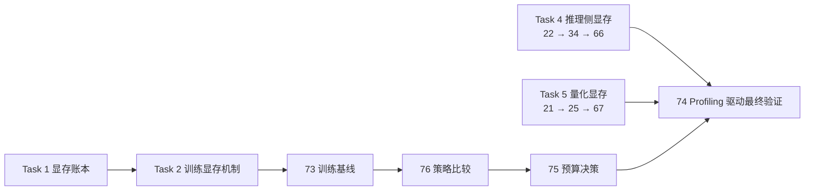

# 07. Visual Assets | 图册收口

## 页面目标

这一页收口显存优化的关键图，方便后续把训练账本、checkpointing / offload、推理 cache、量化预算和最终验证串起来。

## 图册职责

`07` 不是装饰页，而是把 `01-06` 的显存关系压成一组能快速定位问题的图：

- 我的问题是训练显存还是推理显存？
- 是 activation、optimizer state、KV cache，还是量化预算在主导峰值？
- 当前动作是在省驻留、重算、搬运，还是压缩表示？

## 建议图册

- 显存优化路线总图：训练侧、推理侧和量化分支汇入 `74` 最终验证
- VRAM / memory ledger 总图
- training memory pressure 图
- checkpointing / offload trade-off 图
- KV cache budget 图
- quantization as memory tool 图
- benchmark / keep-tune-switch 决策图

## 当前已落地图

### 00 显存优化路线总图

这张图只表达路线关系，不替代各页对 checkpoint、KV Cache 或量化机制的解释。

### 01 VRAM / Memory Ledger

> 图示占位：VRAM ledger 尚未生成。

### 02 Training Memory Pressure

> 图示占位：Training memory pressure 尚未生成。

### 03 Checkpointing / Offload

> 图示占位：Checkpointing and offload trade-off 尚未生成。

### 04 KV Cache Budget

> 图示占位：KV cache budget 尚未生成。

### 05 Quantization as a Memory Tool

> 图示占位：Quantization as a memory tool 尚未生成。

### 06 Benchmark / Keep-Tune-Switch

> 图示占位：Memory benchmark decision flow 尚未生成。

## 建议顺序

1. 路线总图：先确认训练侧主线和推理 / 量化扩展的汇合点
2. 账本总图：对应 `01`
3. 训练侧显存压力图：对应 `02`
4. checkpointing / offload 图：对应 `03`
5. 推理 cache 与预算图：对应 `04`
6. 量化作为显存手段图：对应 `05`
7. benchmark / 决策图：对应 `06`

## 图的风格约束

- 一张图只回答一个显存问题，不把训练、推理和部署强行塞进同一张图。
- 正式资产优先用 `SVG`。
- 图标题尽量直接说明“谁在占显存、代价换到哪里去了”。

## 相关跳转

- 回到 [显存优化入口](./intro.md)
- 回到 [显存优化与性能调优正文](./casebook.md)
- 回到 [显存优化与性能调优深入阅读](./walkthrough.md)
