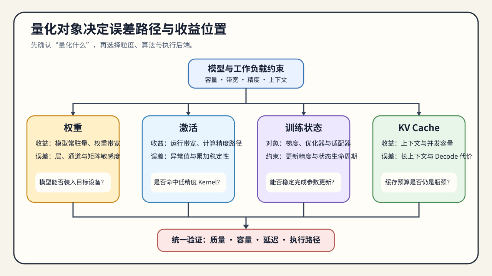

# 01. Quantization Objects, Representation, and Error | 量化对象、表示与误差

## 本页目标与路线位置

本节回答两个问题：

- 量化到底在压什么，压的是权重、激活、训练状态，还是 KV Cache？
- 为什么量化的核心不是“位宽更小”，而是“误差能不能被系统接受”？

这是 Task0–1 的共同入口。Task0 识别对象、生命周期和证据类型，Task1 进一步理解 scale、zero point 与量化粒度。读完后应能写出一份量化问题定义：对象、表示、目标 workload、误差来源、质量下限和证据等级。

## 核心机制

量化最容易被误解成“把 `fp16` 改成 `int8`”。但真正决定量化效果的，不只是位宽，而是三件事：

- 你压缩的是哪一类对象；
- 你用什么 scale / zero-point / 粒度去表示它；
- 量化误差会不会落在系统最敏感的位置。

如果这三件事没分清，后面的 PTQ、QAT、GPTQ、AWQ、FP8 都会变成名词堆叠。

开始量化前，先确认：

- 当前要压的是权重、激活、梯度/优化器状态，还是 KV Cache。
- 你的目标是省显存、降带宽，还是配合硬件执行栈。
- 误差更敏感的是训练稳定性、任务质量，还是运行时容量和速度。

量化的核心矛盾是：低比特表示能显著降低存储和带宽成本，但也会引入表示误差。量化专题的主线，就是在“压缩率”和“误差可接受性”之间找平衡。

### 量化映射

对一个浮点值 `x` 做线性量化时，常见形式是：

```text
q = clamp(round(x / scale) + zero_point, q_min, q_max)
x_hat = (q - zero_point) * scale
```

`scale` 决定数值范围映射到多少个离散等级，`zero_point` 负责非对称范围的平移，`clamp` 处理超出范围的值。误差不只来自 bit width，还来自校准样本、分组或通道粒度、异常值处理以及反量化发生的位置。

| 决策变量 | 改变什么 | 需要观察的结果 |
|:---|:---|:---|
| bit width | 可表示等级数量和存储大小 | 量化误差、模型大小、加载显存 |
| scale / zero-point | 浮点范围到整数范围的映射 | 饱和比例、均方误差、输出偏差 |
| 粒度 | 一组数值共享一套量化参数的范围 | 参数开销、误差分布、kernel 适配 |
| 校准数据 | 量化参数覆盖的输入分布 | 代表性变化时的质量稳定性 |

量化公式只能解释数值偏差；训练稳定性、任务质量和运行速度还取决于对象生命周期、模型结构、执行路径与 workload。



## 选择条件与验证证据

按“对象 → 粒度 → 敏感性 → 介入时机”判断路线，并为下一阶段保留对应证据：

| 先观察什么 | 更可能进入的路线 | 下一步要留下的证据 |
|:---|:---|:---|
| 权重驻留是显存主因 | W8A16、GPTQ / AWQ | 量化配置、校准数据版本、权重误差和 artifact manifest |
| PTQ 后任务质量不足，但仍有训练预算 | QLoRA、QAT 或量化微调 | adapter / merged model、验证集质量和训练配置 |
| 矩阵乘执行路径或带宽是主因 | 激活量化、FP8 | scale、dtype、硬件能力和 kernel / backend 证据 |
| 长上下文或高并发使缓存成为主因 | KV Cache 量化 | cache dtype、上下文 workload、显存和 TPOT |

- 权重量化首先影响驻留大小和带宽。
- 激活量化更容易碰到执行路径和精度稳定性问题。
- KV cache 量化更偏推理预算，不应与权重量化混为一谈。

CPU 或纯 PyTorch 实验可以验证量化公式、舍入、截断、误差统计和不同粒度的差异；它不能证明低比特训练是否稳定，也不能证明目标 GPU 命中了低精度 kernel。训练证据进入 26/65，推理 artifact 与执行证据进入 82/67，性能结论必须回到目标 workload。

下一步进入 [02 PTQ 与 QAT 的介入时机](./02_ptq_and_qat_timing.md)，判断量化应发生在训练之后，还是需要把误差带回训练过程。
