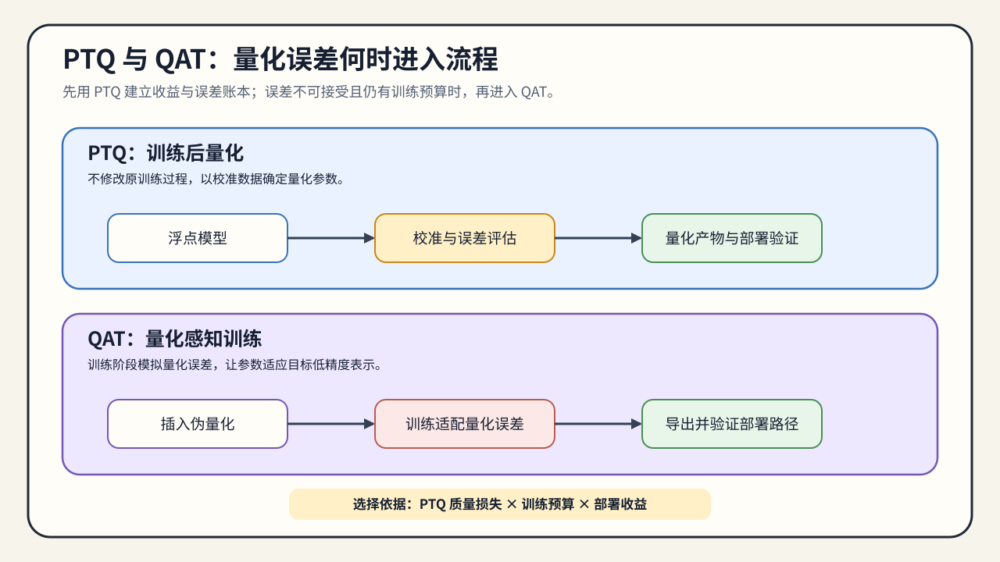

# 02. PTQ and QAT Timing | PTQ 与 QAT 的介入时机

## 本页目标与路线位置

本节回答的是：什么时候先做 PTQ，什么时候必须把量化误差带回训练过程。

这是 Task2 的入口，也是 Task3 的分流点。本节的输出包括两部分：选择先做 PTQ，还是为精度恢复付出 QAT / 量化微调成本；同时冻结 calibration / validation / test 的数据职责和版本。后续权重量化页面直接消费这份协议，不重新划分数据。

## 核心机制

量化真正的第一道选择，不是 GPTQ 还是 AWQ，而是“量化发生在训练后，还是训练中”。这件事决定了：

- 你能不能用最小成本快速落地；
- 你有没有机会让模型适应量化误差；
- 量化路线会不会和 LoRA / QLoRA、继续训练等动作绑在一起。

选择介入时机前，先确认：

- 你有没有训练预算。
- PTQ 后精度损失是否已经不可接受。
- 你的目标是快速得到可比较候选，还是用训练成本恢复质量。

PTQ 便宜、快、适合快速验证；QAT 更重，但能让模型在训练时学会适应量化误差。两者的差别，不只是“训练前后”的时间点，而是你愿意把多少复杂度付给训练过程。

### 介入时序

PTQ 通常先使用代表性数据估计量化参数，再冻结量化表示评估模型；QAT 则在训练过程中插入 fake quantization 或等价的量化误差模拟，让前向路径感知离散化带来的偏差，反向传播仍需要可训练的近似梯度。

| 阶段 | 主要状态 | 主要风险 | 最小证据 |
|:---|:---|:---|:---|
| PTQ 校准 | 模型参数基本不变，估计 scale / zero-point | 校准数据不代表目标输入 | 校准集摘要、误差分布、任务质量 |
| PTQ 执行 | 量化参数冻结，由 loader/backend 接收 | 格式或 kernel 不匹配 | 加载状态、执行路径、质量与资源指标 |
| QAT / 量化微调 | 训练过程适应量化噪声 | 训练成本、收敛和部署格式不一致 | train / val 曲线、最终 artifact、部署复验 |

校准、验证和测试数据承担不同职责。校准数据还要覆盖会改变激活范围的长度、领域和批次形态，不能只“随便取几条样本”。

| 数据角色 | 主要用途 | 必须固定的字段 | 常见风险 |
|:---|:---|:---|:---|
| 校准集 | 估计 scale、zero-point、敏感性或激活范围 | 版本、split、抽样规则、样本数、长度分桶、领域比例、batch/并发形态 | 分布过窄，范围覆盖不足 |
| 验证集 | 调整 QAT 或低比特适配过程 | 版本、split、seed、指标与评测脚本 | 反复调参导致结果偏乐观 |
| 测试集 / 业务样例 | 给出最终独立质量证据 | 固定样例、指标版本、运行配置 | 与校准分布不同，暴露长上下文或格式问题 |

如果只是比较 PTQ 与 QAT 的方向，可以先使用小规模、固定版本的校准集；如果要形成训练或推理结论，则必须保存一份校准协议，至少包含数据版本、split、抽样规则、长度分布和独立评测入口。04 使用这份协议生成 GPTQ / AWQ 候选，06 再使用独立评测结果形成决策。

“先做 PTQ”是一种成本控制策略，不是质量保证；“改用 QAT”也不意味着部署后一定更快。两种方案都要使用同一验证集和同一部署目标比较。本页结束时应得到“介入时机 + 数据角色协议”，而不是量化 artifact。

## 选择条件与验证证据

### 从 PTQ 结果选择下一步

PTQ 不是一条必须走到底的路线，而是一次低成本分流。用同一份质量评测结果决定下一步：

| PTQ 观察到的结果 | 推荐动作 | 交给下一页的信息 |
|:---|:---|:---|
| 质量达标，权重仍是主要成本 | 进入 W8A16 或 GPTQ / AWQ | 校准协议、质量门槛、目标格式 |
| 质量轻微下降，训练预算有限 | 进入 QLoRA 或量化微调 | SFT checkpoint、训练预算和验证协议 |
| 激活范围或执行路径成为瓶颈 | 进入激活量化 / FP8 局部机制验证 | 激活统计、目标硬件和 workload |
| 长上下文下显存或并发不足 | 进入 KV Cache 量化 | Cache 账本、上下文和并发条件 |
| 无法加载或质量明显不达标 | 暂停部署并定位原因 | 失败日志、配置差异和复测条件 |

这样可以把 `25` 的 W8A16、`40` 的 GPTQ / AWQ、`53` 的激活平滑、`26/65` 的 QLoRA，以及 `41/54` 的运行时与 KV Cache 量化放在同一条决策链上，而不是把它们当成互相替换的算法清单。

- PTQ 更适合低成本建立量化候选和误差基线。
- QAT 更适合“量化误差已经成为主矛盾”。
- 继续训练并不总比 PTQ 更划算，因为训练成本本身也要进入总收益判断。

CPU 实验适合验证 PTQ / QAT 的流程、量化误差注入、校准统计和决策逻辑；它不能证明低比特训练 kernel、真实训练显存或部署吞吐。GPU 训练还需要记录 dtype、batch、序列长度、训练步数、峰值显存、step time、验证质量和 OOM 状态；量化推理则应转到固定 backend 的对比实验。

如果 PTQ 的质量损失超过门槛，进入 [03 低比特训练适配](./03_low_bit_training_adaptation.md)；如果 PTQ 已可接受，则进入 [04 权重量化与后训练压缩](./04_weight_only_compression.md) 完成权重候选。PTQ 先校准再评测，QAT 则让模型在训练中适应量化误差。
