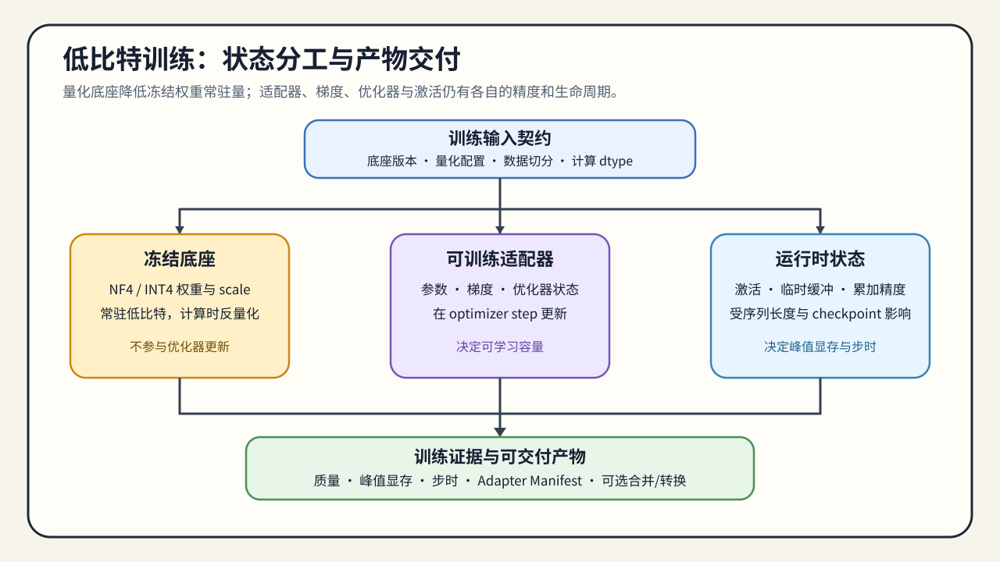

# 03. Low-Bit Training Adaptation | 低比特训练适配

## 本页目标与路线位置

本节回答的是：当纯 PTQ 不够时，为什么会出现 QAT、LoRA / QLoRA 这类“训练适配量化”的路线。

这是 Task3 的后训练交叉页，不把 QLoRA 当作推理量化 artifact。本节的输出是训练适配决策：质量损失是否值得通过额外训练恢复，以及训练显存、时间和稳定性是否被纳入收益计算。

## 核心机制

很多量化问题并不是“压不下去”，而是“压下去后质量下降过多”。进入这个阶段后，量化会同时影响训练稳定性、可训练状态和适配效率。

进入训练适配前，先确认：

- PTQ 失败的根因是误差太大，还是目标任务本来就需要继续适配。
- 你还有没有继续训练或微调预算。
- 你需要的是 full QAT，还是更轻的低比特适配路线。

低比特训练适配的核心矛盾是：系统希望把模型表示压低，但模型本身又需要重新吸收这部分误差。于是，量化不再只是表示问题，而会变成训练稳定性和微调效率问题。

### 训练状态

QLoRA 等路线通常把基座模型以低比特形式加载，计算时使用指定的 compute dtype，同时只更新 LoRA adapter。它减少的是可训练参数、梯度和 optimizer state 的规模；这不等于基座权重、激活和训练临时张量全部变成低比特。

| 状态 | 典型表示 | 主要显存来源 | 需要确认的边界 |
|:---|:---|:---|:---|
| 基座权重 | INT4 / NF4 等低比特存储 | 量化权重、scale 和加载临时空间 | 是否由训练库正确加载并支持反量化 |
| adapter 参数 | FP16 / BF16 或 FP32 | adapter、梯度、optimizer state | trainable 参数量和优化器状态是否匹配 |
| 前向与反向 | 通常使用 compute dtype | activation、临时张量和重算 | 序列长度、batch 与 checkpoint 是否改变峰值 |

因此，QLoRA 的收益应拆成“训练状态减少”和“运行时计算代价”两部分，不能只用模型文件大小解释训练显存或速度。

## 选择条件与验证证据

### 训练适配如何交付后续验证

低比特训练适配的输出是训练产物和训练证据，不等于已经完成推理量化。后续是否进入合并、转换或部署，由实际使用目标决定：

| 阶段 | 需要确认什么 | 输出给下一阶段的内容 |
|:---|:---|:---|
| 适配训练 | 基座 revision、量化配置、compute dtype、可训练参数和验证集 | 训练配置、loss / quality 结果 |
| 产物整理 | adapter 是否可独立加载，是否需要 merge | adapter 或 merged model manifest |
| 独立评测 | 训练结果是否达到任务质量和稳定性门槛 | 固定评测结果、失败样例和适用范围 |
| 推理交接（按需） | 是否需要 merge、重新量化或转换目标格式 | 可定位 artifact、转换记录和 loader 条件 |

`26` 负责 QLoRA 机制，`65` 负责训练适配项目的选择和产物。只有需要部署时，才把候选交给 82/67/83；adapter 能加载只能证明训练产物契约成立，不能替代目标 backend 的执行证据。

- full QAT 更完整，但成本最高。
- LoRA / QLoRA 更像“低比特前提下的适配折中”。
- 如果任务本身变化不大，继续训练未必比更好的 PTQ / AWQ / GPTQ 更划算。

### 训练框架与产物选择

框架选择首先取决于学习目标和产物要求，而不是工具名本身：

| 目标 | 推荐路径与必须交付的产物 |
|:---|:---|
| 理解训练机制、逐项控制配置 | TRL / 原生 Transformers + PEFT；保留量化配置、trainable 参数、loss 与验证结果 |
| 单卡快速验证 QLoRA | Unsloth 或等价轻量封装；保留版本、显存、step time 与 adapter manifest |
| 配置驱动的重复实验 | LLaMA-Factory / Axolotl；保留 YAML、数据版本、checkpoint 与复现实验命令 |
| 进入部署链路 | PEFT / Transformers 产物再转换；保留 adapter/merged model、转换日志与目标格式 |

这些框架可以降低训练入口成本，但不能替代量化 artifact 的格式检查和部署 benchmark。学习者应先明确输出是 adapter、merged model 还是推理量化文件，再选择框架。

CPU 或小模型实验可以验证 adapter 是否只更新目标参数、量化配置字段、梯度路径和损失计算；真实 GPU 才能验证训练峰值、低比特 kernel、step time、OOM 和数值稳定性。训练适配后的 adapter 还要经过独立的合并或加载测试，不能直接当成 67 的推理量化 artifact。

若目标是压缩模型驻留并尽量保持推理路径稳定，进入 [04 权重量化与后训练压缩](./04_weight_only_compression.md)；若瓶颈来自运行期激活、FP8 计算或缓存预算，则进入 [05 运行期量化路径](./05_fp8_and_kv_cache_quantization.md)。
