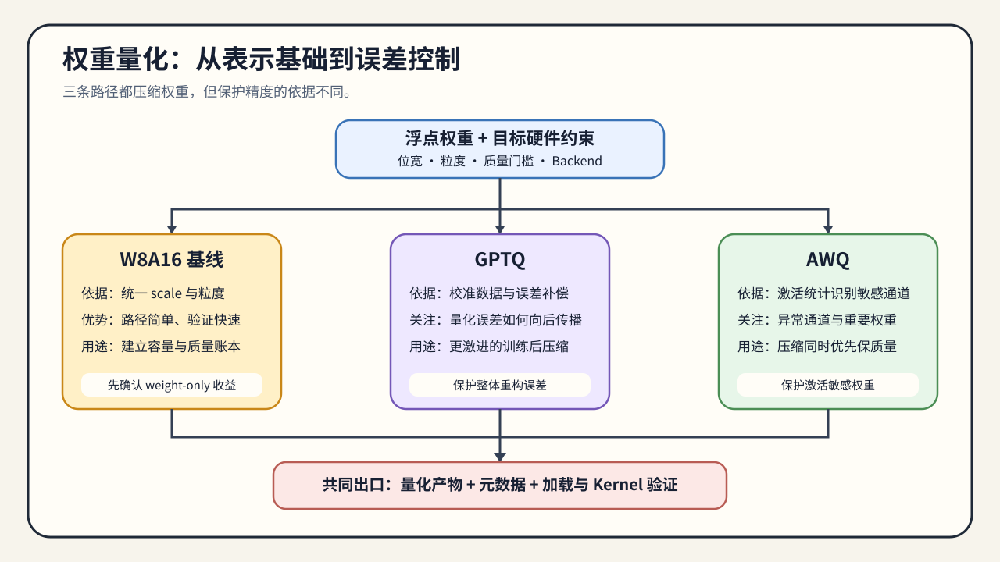

# 04. Weight-Only Quantization | 权重量化与 PTQ 误差控制

## 本页目标与路线位置

本节回答的是：weight-only、GPTQ 和 AWQ 如何在不重新训练模型的前提下控制权重量化误差，以及候选产物怎样进入真实执行路径。

这是 Task2 的权重 PTQ 落点，也连接 Task5 的 artifact 契约。Task1 提供 scale、zero point 与粒度基础，02 提供已经冻结的数据角色与校准协议；本节使用这些输入形成带有量化元数据、校准摘要和质量结果的权重量化候选。

## 核心机制

当模型参数的驻留容量和读取带宽成为主要成本时，权重量化通常比激活或 KV Cache 量化更先进入候选。需要依次回答：

- 能不能先把权重压下来，让模型装进目标卡；
- 压下来以后，精度损失能不能控制在可接受范围内。

GPTQ / AWQ 就是在这个问题上出现的。

形成权重量化候选前，先确认：

- 权重驻留是不是预算主因。
- 你更看重极限压缩率，还是更稳的精度保持。
- 是否有继续训练预算；没有训练预算时，应先验证 PTQ 候选。

权重量化的核心矛盾是：低比特能显著降低模型驻留成本，但某些层、通道和矩阵对误差异常敏感。GPTQ / AWQ 的存在，就是为了在后训练阶段尽量保住这些敏感位置。

### 从 W8A16 进入 GPTQ / AWQ

W8A16、GPTQ 和 AWQ 不是互相独立的三个名词，而是一条逐步增加误差控制复杂度的路线：

| 路线 | 主要解决的问题 | 额外机制 | 适合先验证什么 |
|:---|:---|:---|:---|
| W8A16 | 先确认低比特权重是否能降低驻留和带宽 | 通常保留较高精度激活 | 表示、反量化、显存和基础质量 |
| GPTQ | 权重重建误差较大，需要逐步补偿 | 近似二阶信息与校准样本 | 敏感层误差、group size、任务质量 |
| AWQ | 少数重要通道对质量影响更大 | 激活感知缩放与通道保护 | 激活分布、保护比例、backend 支持 |

因此，先用 W8A16 建立表示和误差基线，再决定是否需要 GPTQ / AWQ 的额外校准和误差控制。若 W8A16 已满足质量与资源约束，继续增加校准复杂度未必有收益。

### 权重表示与执行

权重量化通常保留低比特权重，并额外保存分组或通道级量化参数。执行时，矩阵乘法可能在 kernel 内完成反量化，也可能先生成更高精度临时值；这决定了模型常驻显存下降后，实际 workspace、带宽和延迟是否仍然可接受。

| 方法 | 误差控制思路 | 依赖的输入 | 不能忽略的代价 |
|:---|:---|:---|:---|
| GPTQ | 根据权重重建误差逐步调整量化值 | 校准样本、权重统计和量化配置 | 校准耗时、格式与执行 kernel 绑定 |
| AWQ | 利用激活敏感性保护重要通道或权重 | 代表性激活、分组和缩放配置 | 激活分布变化、backend 支持和额外参数 |

GPTQ 与 AWQ 负责控制误差；artifact 格式、loader 与目标硬件决定候选能否进入真实低精度执行路径。

GPTQ / AWQ 的质量回归应同时覆盖“量化误差”和“真实任务行为”。校准阶段可以使用代表性激活，但最终评测应使用独立的验证集或业务样例，并覆盖目标服务中的长输入、结构化输出和高频敏感任务。

| 回归层 | 对照内容 | 主要指标 | 结论用途 |
|:---|:---|:---|:---|
| 权重层 | 浮点权重 vs 量化权重 | 误差、scale、敏感层变化 | 检查量化是否按预期完成 |
| logits 层 | 相同输入下的输出分布 | max error、KL 或一致性指标 | 定位数值偏移 |
| 任务层 | 浮点模型 vs 量化模型 | 准确率、格式成功率、任务质量 | 判断质量是否达标 |
| 服务层 | 同 workload 的 baseline / candidate | 显存、TTFT、TPOT、吞吐、P99 | 判断部署收益是否成立 |

## 选择条件与验证证据

1. 最基础的是 W8A16 这类易落地的权重量化。
2. 如果压缩还不够或精度退化太大，再看 GPTQ / AWQ。
3. 最后进入 Task5–6，确认 artifact、执行路径和目标 workload 的收益。

### 校准数据到权重量化候选

GPTQ / AWQ 的方法差异，最终要落实为一条可复查的候选生成链：

`校准数据 → 敏感性 / 误差统计 → 量化配置 → 权重量化产物 → 离线质量门槛`

| 环节 | 应回答的问题 | 不能省略的记录 |
|:---|:---|:---|
| 校准协议 | 是否引用 02 冻结的数据角色、版本和抽样规则？ | calibration manifest id、长度与领域摘要 |
| 量化配置 | bit width、group size、scale 和保留层是否明确？ | 完整 config、版本和生成命令 |
| 权重量化产物 | 文件是否完整、可定位、可复用？ | 路径、hash / revision、manifest |
| 离线质量 | 权重、logits 与任务质量是否通过门槛？ | 独立评测结果、失败样例和敏感层摘要 |

这一页只负责生成可追溯的权重量化候选并检查离线质量。加载器兼容性、执行后端、低精度 Kernel 与真实工作负载收益统一交给 06 验证。

- GPTQ 更偏误差补偿和近似最优重建。
- AWQ 更偏激活感知，优先保护敏感通道。
- 两者都属于后训练路线，但侧重点不同，不是简单替换关系。

CPU 或机制模拟可以验证分组量化、权重重建误差和敏感性排序；它不能证明真实产物能被目标后端加载，也不能证明使用了预期的低精度 Kernel。这些执行证据在 06 中补齐。

如果瓶颈转向运行期激活、FP8 计算或 KV Cache，进入 [05 运行期量化路径](./05_fp8_and_kv_cache_quantization.md)；权重候选则进入 [06 产物、执行与工作负载决策](./06_deployment_and_benchmark_decision.md)检查加载和执行路径。
