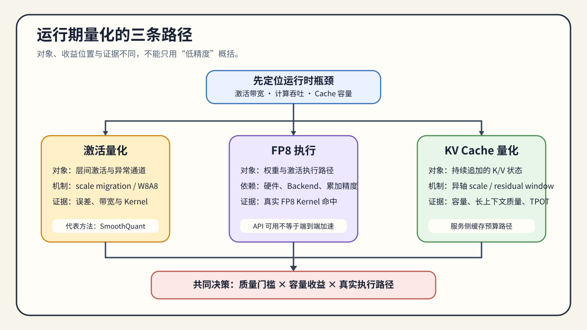

# 05. Runtime Quantization Paths | 运行期量化路径

## 本页目标与路线位置

本节回答三个相互关联但不能混为一谈的问题：激活表示、FP8 计算路径和 KV Cache 状态分别改变什么；硬件、backend 和上下文长度如何改变选择。

这是 Task4 的运行时分支。输出不是笼统的“低精度有效”，而是三类独立候选：激活量化、FP8 执行和 KV Cache 量化，各自记录对象、scale、kernel/cache 行为、质量与资源证据。

## 核心机制

三条路径都会减少某类数据的字节数，但改变的对象和阶段不同：

- 激活量化处理层间张量范围、异常值和矩阵乘输入；
- FP8 依赖硬件、scale 与 kernel，改变低精度计算路径；
- KV Cache 量化压缩请求生命周期中的追加状态，主要影响长上下文和并发预算。

它们都不同于只改变权重驻留的 weight-only 路线，不能共用一份执行结论。

选择运行时低精度路径前，先确认：

- 当前瓶颈来自执行栈，还是来自 cache 预算。
- 硬件是否已经原生支持 FP8。
- 长上下文和并发是否已经把 KV cache 顶成第一约束。

激活量化需要在异常值与执行收益之间取舍；FP8 需要硬件和 kernel 栈配合；KV Cache 量化能扩大上下文和并发预算，但会增加状态量化、读取和质量风险。

### 运行时路径

激活量化先改变中间张量的表示，再决定 FP8 是否能沿着硬件和 kernel 路径执行；KV Cache 量化则改变请求生命周期中 K/V 状态的存储与读取方式。三者都可能减少字节数，但影响的时间段不同：激活量化影响算子之间的中间状态，FP8 影响执行路径，KV Cache 量化集中在 decode 阶段的 cache 读写。

| 路线 | 主要对象 | 关键变量 | 需要对齐的 workload |
|:---|:---|:---|:---|
| 激活量化 | 中间激活与矩阵乘输入输出 | calibration、scale、异常值、累积精度 | prefill / decode、输入长度、输出长度 |
| FP8 | 权重、激活或矩阵乘输入输出 | scaling、硬件能力、kernel、混合精度边界 | prefill / decode、输入长度、输出长度 |
| KV Cache 量化 | 每个请求的 K/V 状态 | cache dtype、量化粒度、更新与反量化位置 | 上下文长度、并发、prefix sharing、TPOT |

权重量化与 KV Cache 量化可以同时出现，但必须分别记录容量账本和质量影响；组合收益需要重新实测，不能直接相加。

## 选择条件与验证证据

1. 先判断主要约束来自激活范围、低精度计算路径，还是缓存预算。
2. 激活异常值或层间搬运是主因时，先看激活量化与平滑。
3. 执行栈和硬件支持是主因时，验证 FP8。
4. 长上下文和高并发预算是主因时，验证 KV Cache 量化。
5. 最后回到推理与性能专题，在请求链路和容量账本中验证综合效果。

### 运行时状态如何变化

运行时低精度的关键不只是“存成几 bit”，还包括 scale 由谁计算、何时更新，以及读取时在哪里恢复精度：

| 状态 | 量化参数通常在哪里产生 | 读取 / 计算时需要确认什么 |
|:---|:---|:---|
| 激活 | 校准阶段或运行时统计 | scale 是否覆盖当前输入，累积精度是否足够 |
| FP8 输入 / 权重 | 模型配置、历史统计或动态 scale | Tensor Core 路径、累积 dtype、fallback |
| KV Cache | cache 初始化或按块 / 按 token 更新 | 量化粒度、反量化位置、cache 读写开销 |

这解释了为什么同样的低比特表示，在离线张量误差上看起来可接受，进入长上下文服务后仍可能出现 TPOT、质量或并发收益不稳定。

证据应按三层递进：先用 CPU / 数值模拟验证公式和误差，再用 GPU 环境预检与局部机制 benchmark 确认 dtype 和执行候选，最后在固定 backend 和 workload 上验证服务指标。三层结果不能互相替代，也不能把 FP8 的执行证据直接当成 KV Cache 量化的服务证据。

- 激活范围和异常值主导误差时，先验证平滑、scale 与累积精度。
- 计算路径和 Tensor Core 利用率是主因时，验证 FP8 kernel 与 fallback。
- 长上下文和并发容量是主因时，验证 KV Cache 粒度、读写成本、质量与 TPOT。
- 三条路径组合后必须重新复测，不能直接相加各自的理论收益。

| 证据层级 | 能回答什么 | 不能替代什么 |
|:---|:---|:---|
| CPU / 数值模拟 | scale、量化误差、字节数、KV Cache 账本 | 真实 kernel、显存和服务延迟 |
| GPU 环境预检 / 局部机制 benchmark | FP8 dtype、scale、Tensor Core 候选路径是否可运行 | 目标 serving backend 的完整行为 |
| backend benchmark | cache 分配、TTFT、TPOT、并发、质量和回退路径 | 不同 workload 下的泛化结论 |

`torch.cuda.is_bf16_supported()` 或格式字段本身不能替代 kernel 和 workload 实测。激活量化、FP8 局部机制结果、KV Cache 模拟和 serving backend 结果必须分别记录，不能合并成一个“量化有效”结论。

将激活、FP8 与 KV Cache 候选交给 [06 产物、执行与工作负载决策](./06_deployment_and_benchmark_decision.md)分别验证；质量低于门槛时再进入 [03 低比特训练适配](./03_low_bit_training_adaptation.md)，不能用局部 dtype 或字节数结果替代目标 workload 证据。
