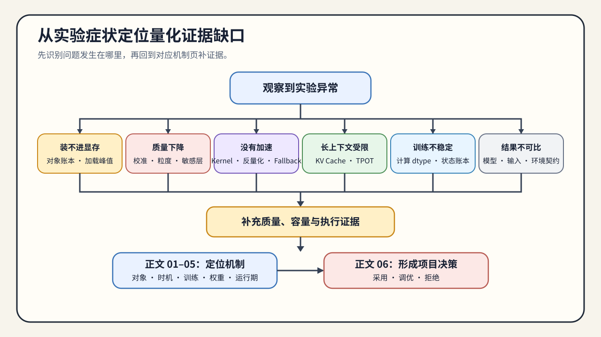

# 量化问题排查手册

这份手册按实验现象组织。第一次系统学习量化时，从[量化问题链](./walkthrough.md)进入；已经遇到质量、容量、加载或性能问题时，先在下表定位，再转到对应机制页补充证据。

## 使用方式

1. 先确认发生问题的对象：权重、激活、训练状态还是 KV Cache。
2. 再区分问题属于数值误差、artifact、执行路径还是目标 workload。
3. 根据“缺少的证据”补测；证据完整后，到 [06 产物、执行与工作负载决策](./06_deployment_and_benchmark_decision.md)形成 `accept / tune / reject`。

## 症状索引

| 现象 | 优先检查 | 需要补充的证据 | 转到哪一页 |
|:---|:---|:---|:---|
| 权重文件变小，但模型仍装不进显存 | 加载峰值、scale 元数据、临时 workspace、allocator 保留量 | 加载前后峰值、常驻显存、artifact manifest | [01 对象与误差](./01_quantization_object_and_error.md)、[04 权重量化](./04_weight_only_compression.md) |
| 量化后任务质量下降 | 校准分布、敏感层、粒度、异常值和独立评测集 | 权重/logits 误差、任务质量、失败样例 | [02 PTQ 与 QAT](./02_ptq_and_qat_timing.md)、[04 权重量化](./04_weight_only_compression.md) |
| 显存下降但延迟或吞吐没有改善 | 反量化位置、目标 kernel、fallback、workload 是否受带宽限制 | kernel/profiler、TTFT、TPOT、吞吐和 workspace | [05 运行期量化路径](./05_fp8_and_kv_cache_quantization.md)、[06 执行与决策](./06_deployment_and_benchmark_decision.md) |
| Artifact 可以加载，但运行时回退浮点 | quant config、loader、backend 版本与支持矩阵 | loader 日志、实际 dtype、kernel/fallback 记录 | [06 执行与决策](./06_deployment_and_benchmark_decision.md) |
| 长上下文或高并发仍受限 | KV Cache dtype、粒度、上下文长度、并发和 cache policy | Cache 账本、质量、TPOT、并发容量 | [05 运行期量化路径](./05_fp8_and_kv_cache_quantization.md) |
| QLoRA 不稳定或没有明显节省资源 | compute dtype、可训练参数、激活、优化器状态和 checkpoint | loss/quality、峰值显存、step time、adapter manifest | [03 低比特训练适配](./03_low_bit_training_adaptation.md) |
| 不同 backend 的结果无法比较 | 模型/tokenizer revision、输入 token、量化格式和采样配置 | 固定 workload、环境版本、原始结果 JSON | [06 执行与决策](./06_deployment_and_benchmark_decision.md) |

## 排查路径

### 容量没有按理论比例下降

先把文件大小、加载峰值、运行时常驻显存和峰值显存分开。权重变小只说明存储表示改变；scale、zero-point、临时反量化张量和 workspace 仍会占用显存。若权重已经不是主要对象，应继续检查激活、训练状态或 KV Cache，而不是继续降低权重位宽。

### 质量下降超过门槛

先确认校准集与最终评测集已经隔离，再比较粒度、group size、异常值和敏感层。PTQ 误差较小时继续优化校准或权重方法；误差仍超过门槛且具备训练预算时，再进入 QAT 或低比特训练适配。不要用校准集上的误差直接替代任务质量。

### 低比特没有带来速度收益

确认目标 backend 是否命中低比特 kernel，以及反量化、scale 读取和临时 workspace 是否抵消带宽收益。长 Prefill、短 Decode、单请求和高并发可能得到不同结论，因此必须保留同 workload 的浮点 baseline。

### Artifact、Loader 与 Backend 不匹配

分别记录量化方法、数值格式、artifact 格式、loader、backend 和 kernel。GPTQ、AWQ 描述误差控制方法，INT4、FP8 描述表示，GGUF 描述文件格式；这些字段不能合并为一个“量化类型”。未说明的 fallback 应判为 `tune`，不能写成低精度执行成功。

### KV Cache 仍限制上下文和并发

权重量化不会自动减少 KV Cache。检查 Key/Value 的粒度、动态 scale、残差窗口、追加状态和反量化位置，并同时测量质量与 TPOT。容量增加但 Decode 变慢时，需要在目标并发下重新判断收益。

### 低比特训练资源或稳定性异常

QLoRA 的低比特基座不代表激活、梯度和优化器状态都使用低比特。先确认 trainable 参数、compute dtype 和训练状态账本，再检查序列长度、micro-batch、梯度累积和 checkpoint。训练产物是 adapter 或 merged model，不等同于推理量化 artifact。

## 何时进入最终决策

只有同时具备以下信息，才进入正文 06：

- 可追溯的模型、tokenizer、量化配置和 artifact；
- 独立质量结果以及失败样例；
- 与 baseline 使用相同输入和执行条件的资源、延迟或吞吐结果；
- loader、backend、kernel 或 fallback 证据；
- 原始日志、结果 JSON 和明确的适用范围。

缺少 artifact 或执行证据时继续补测；质量不达标时回到 02–05 调整机制；证据完整后进入 [06 产物、执行与工作负载决策](./06_deployment_and_benchmark_decision.md)。
