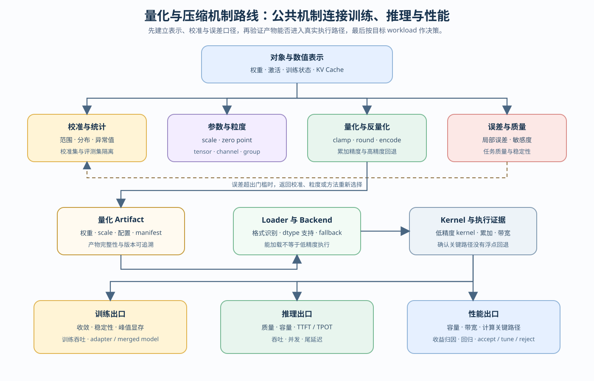
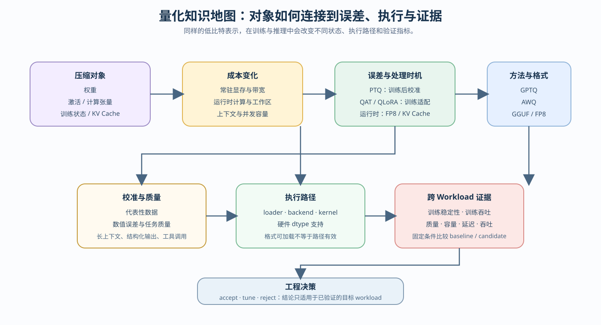

# 量化问题链：从数值表示到跨 Workload 决策

量化选型从对象和 workload 约束开始，而不是从算法名称开始。训练可能受模型状态容量、数值稳定性和吞吐限制；推理可能受权重驻留、激活带宽、KV Cache 容量或低精度执行路径限制。不同问题对应不同的量化对象、介入时机和验证方法。

整条阅读路径使用同一条因果链：

`对象与表示 → 校准统计 → scale / granularity → 量化误差 → artifact → loader / kernel / backend → workload 证据 → 条件化决策`

正文页负责解释单个节点，下面的段落负责说明这些节点如何连接。

## 图册与知识地图

本专题的图册由 walkthrough 承载，不再单独设置“视觉资产”阅读页。入口路线图帮助选择学习分支，知识地图帮助理解对象、误差、执行路径和证据之间的关系；局部机制图继续放在对应正文段落附近。

路线图回答“下一步学什么”，知识地图回答“为什么这些概念相连”。它们不替代 01–06 正文的局部机制说明。

## 第一段：先定位约束和压缩对象

先判断问题来自权重、激活、训练状态还是 KV Cache。权重量化主要改变模型常驻容量和权重读取带宽；激活量化影响中间状态、算子执行和数值稳定性；训练状态量化影响参数更新的容量与稳定性；KV Cache 量化影响长上下文请求的缓存容量、读写带宽和并发上限。

如果对象没有确定，直接比较 INT4、INT8 或 FP8 没有意义。还要明确目标是降低显存、降低带宽、提高并发，还是匹配某种硬件 kernel。

对应 [01 量化对象、表示与误差](./01_quantization_object_and_error.md)。该页建立 scale、zero-point、量化粒度和误差来源的共同口径。

## 第二段：理解误差如何进入系统

量化把连续的浮点值映射到有限的离散等级。scale、zero-point、分组粒度、异常值处理和校准数据共同决定映射误差。误差可能停留在权重层，也可能通过矩阵乘、激活或 KV Cache 读写累积到输出质量。

因此，bit width 只能说明表示范围和存储下界，不能单独说明任务质量或运行速度。需要把量化误差与目标评测集、输入分布和服务 workload 对齐。

这一部分连接 [01 量化对象、表示与误差](./01_quantization_object_and_error.md) 与 [02 PTQ 与 QAT 的介入时机](./02_ptq_and_qat_timing.md)。

## 第三段：决定量化介入时机

PTQ 适合已有模型的快速校准和部署试探；当 PTQ 的质量损失超过边界，且仍有训练预算时，才考虑 QAT 或量化微调。QLoRA 属于训练显存受限下的低比特适配路径，重点是减少可训练状态和维持任务质量，并不等于完成了推理侧权重量化。

选择时需要同时计算校准成本、训练成本、验证成本和部署收益。不能因为 QAT 理论上能恢复质量，就跳过 PTQ 基线；也不能因为 QLoRA 使用低比特基座，就把它的结果直接当作 GPTQ、AWQ 或 GGUF 的推理结果。

对应 [02 PTQ 与 QAT 的介入时机](./02_ptq_and_qat_timing.md)、[QUANT-QAT 量化感知训练](../../02_PyTorch_Algorithms/QUANT-QAT_Quantization_Aware_Training.md)和[03 低比特训练适配](./03_low_bit_training_adaptation.md)。

## 第四段：区分方法、格式和执行路径

进入权重量化时，需要把三个层次分开：GPTQ / AWQ 是误差控制方法，INT4 / INT8 / NF4 / FP8 是数值表示，GGUF 是文件格式与部署封装；Transformers、bitsandbytes、vLLM、llama.cpp 和 TensorRT-LLM 则决定如何加载和执行。

同一种表示在不同 backend 上可能走不同的反量化和矩阵乘路径。模型文件变小，只能说明存储表示发生变化；是否减少运行时显存、是否使用低比特 kernel、是否提升吞吐，必须由目标 backend 验证。

对应 [04 权重量化与后训练压缩](./04_weight_only_compression.md)、[53 激活量化与 SmoothQuant](../../02_PyTorch_Algorithms/53_Activation_Quantization_and_SmoothQuant.md)、[QUANT-MIXED-BIT 混合位宽分配](../../02_PyTorch_Algorithms/QUANT-MIXED-BIT_Mixed_Bit_Allocation.md)、[05 运行期量化路径](./05_fp8_and_kv_cache_quantization.md)与[54 K/V 量化策略](../../02_PyTorch_Algorithms/54_KV_Cache_Quantization_Strategies.md)。

## 第五段：将候选放回目标 workload

训练与推理不能共用一份结论。训练比较固定数据与更新条件，观察稳定性、质量和训练资源；推理比较固定模型、输入与 backend，只替换量化候选。CPU 机制、GPU 局部执行、artifact 生成和 backend benchmark 使用不同证据等级，不能互相替代。

对应 [06 产物、执行与工作负载决策](./06_deployment_and_benchmark_decision.md)。

## 第六段：形成有条件的决策

最终判断不是“哪种量化最先进”，而是候选能否在指定模型、硬件、backend 和 workload 下同时满足质量与资源门槛。训练分支交付训练质量与资源证据，推理分支交付 artifact、执行路径与服务证据；[06 产物、执行与工作负载决策](./06_deployment_and_benchmark_decision.md)统一给出 `accept / tune / reject` 及适用范围。

## 压缩扩展：剪枝、蒸馏与结构稀疏

当前成熟路线仍以量化为主。剪枝需要额外维护 mask、稀疏度调度和恢复训练状态，蒸馏需要教师/学生版本、蒸馏损失和独立评测，结构稀疏还要求目标硬件与 Kernel 支持同一种模式。这些状态不能压缩成量化 artifact 的附属字段。

需要比较这些路径时进入[07 剪枝、蒸馏与结构稀疏](./07_pruning_distillation_and_structured_sparsity.md)。该页负责建立压缩对象与证据分工；具体训练实现、稀疏 Kernel 和真实项目仍是后续建设项。
