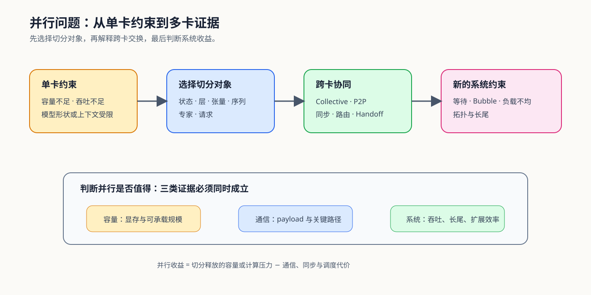

# 01. Why Parallel and Communication | 为什么需要并行与通信

## 本页目标与路线位置

单卡走向多卡通常由容量、吞吐或模型结构约束触发。切分解决局部约束，也会把原本位于设备内部的数据依赖变成跨 rank 的通信、等待和调度问题。学习并行的起点不是记住框架参数，而是先判断“什么必须被切开”。

## 核心机制

### 从约束选择切分对象

同一种性能现象可能对应不同切分方式。先确认受限对象，再估计切分后的交换内容，才能避免用加卡掩盖真正瓶颈。

| 首要约束 | 优先观察的切分对象 | 通信随之出现在哪里 | 典型机制 |
|:---|:---|:---|:---|
| 训练状态装不下 | 参数、梯度、优化器状态 | 参数收集、梯度归约、状态同步 | FSDP、ZeRO |
| 模型层序列装不下 | 连续 Block / stage | stage 间 activation 与梯度 | Pipeline Parallel |
| 单层矩阵或 Head 太大 | 特征维、Head、权重矩阵 | 层内 All-Reduce / Gather / Scatter | Tensor Parallel |
| 长序列状态太大 | sequence / context | K/V 或中间状态的环式交换 | Context Parallel |
| 稀疏专家规模扩大 | expert 与 token | dispatch / combine 的 All-to-All | Expert Parallel |
| Serving 请求规模扩大 | 请求与模型副本 | 路由、队列与缓存局部性 | Replica Serving |

### 并行收益必须扣除协同代价

并行方案的收益不能只看单卡显存下降。至少需要同时检查容量、关键路径和系统输出；其中任一项失败，都可能让“能够运行”无法转化为“值得采用”。

| 证据层 | 需要回答的问题 | 代表指标 |
|:---|:---|:---|
| 容量 | 切分后每个 rank 真正少保存了什么 | peak memory、可承载模型 / batch / context |
| 通信 | 交换了多少数据，发生多少次，是否落在关键路径 | payload、frequency、collective time、exposed communication |
| 系统 | 加卡后是否得到稳定的规模或速度收益 | throughput、step time、P95/P99、scaling efficiency |

## 选择条件与验证证据

| 目的 | 入口 |
|:---|:---|
| 建立硬件和拓扑直觉 | [Part 01 · 03 GPU 架构与显存](../../01_Hardware_Math_and_Systems/03_GPU_Architecture_and_Memory.ipynb)、[05 通信拓扑](../../01_Hardware_Math_and_Systems/05_Communication_Topologies.ipynb) |
| 比较切分策略 | [Part 01 · 26 并行策略决策](../../01_Hardware_Math_and_Systems/26_Parallel_Strategy_Decision_Framework.ipynb) |
| 进入机制实现 | [Part 02 · 27–29](../../02_PyTorch_Algorithms/2_9.md)、[46–49](../../02_PyTorch_Algorithms/2_9.md) |
| 形成多卡结论 | [07 Benchmark 与并行决策](./07_benchmark_and_parallel_decision.md) |

## 相关阅读

- [PyTorch Distributed Overview](https://pytorch.org/tutorials/beginner/dist_overview.html)
- [NCCL 官方文档](https://docs.nvidia.com/deeplearning/nccl/user-guide/docs/)
