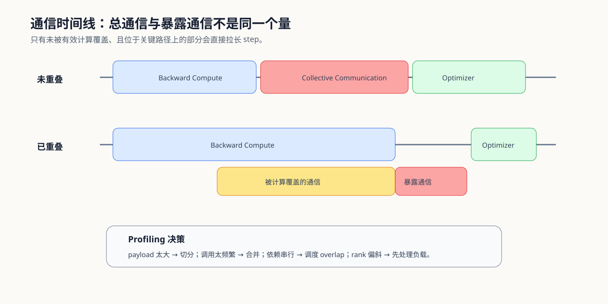

# 06. Communication Profiling and Overlap | 通信剖析与重叠

## 本页目标与路线位置

通信总时长不等于真正拖慢关键路径的通信时间。Profiling 要把 collective 放回计算时间线，区分已被计算覆盖的部分和暴露在 step 或请求关键路径上的部分，再决定减少 payload、降低频率还是调整调度。

## 核心机制

### 用四个量解释通信成本

| 量 | 回答的问题 | 常见来源 |
|:---|:---|:---|
| collective | 采用什么协同语义 | All-Reduce、Gather、Scatter、All-to-All、P2P |
| payload | 每次交换多少字节 | 梯度 bucket、activation、KV、token dispatch |
| frequency | 一个 step / 请求触发多少次 | bucket 数、层数、micro-batch、路由轮次 |
| overlap | 有多少通信与有效计算并行 | stream、bucket ready time、双缓冲与调度 |

### 从 Trace 定位暴露通信

先在 trace 中确定依赖关系，再比较 max-rank 时间。简单相加所有 NCCL kernel 会重复计算已经与计算重叠的部分，也无法解释某个热点 rank 为什么拖慢全局同步。

| Trace 现象 | 可能原因 | 下一步验证 |
|:---|:---|:---|
| 大量短 collective | bucket 太碎、启动成本占主导 | 合并 bucket，比较调用次数与总时间 |
| 单次长 collective | payload 大或链路带宽不足 | payload sweep、拓扑与有效带宽 |
| 通信与计算串行 | 依赖过紧、stream 或调度未重叠 | 检查 ready time、stream 和执行顺序 |
| rank 间时间差异大 | workload、路由或 stage 不均 | 对比 per-rank load 与 max-rank time |
| 总通信高但 step 未变慢 | 大部分通信已被覆盖 | 记录 exposed communication 而非仅总时长 |

## 选择条件与验证证据

| 目的 | 入口 |
|:---|:---|
| 建立异步执行直觉 | [Part 01 · 17 CUDA Stream](../../01_Hardware_Math_and_Systems/17_CUDA_Stream_and_Asynchrony.ipynb) |
| 学习通信调度 | [Part 01 · 27 通信调度优化](../../01_Hardware_Math_and_Systems/27_Communication_Scheduling_Optimization.ipynb) |
| 实测 collective matrix | [Part 02 · 46 NCCL 通信 Profiling](../../02_PyTorch_Algorithms/46_Communication_Profiling_with_NCCL.ipynb) |
| 从 trace 形成缓解策略 | [Part 02 · 48 通信热点](../../02_PyTorch_Algorithms/48_Communication_Hotspots_and_Mitigation.ipynb) |

## 相关阅读

- [PyTorch Profiler](https://pytorch.org/docs/stable/profiler.html)
- [NVIDIA Nsight Systems](https://docs.nvidia.com/nsight-systems/)
