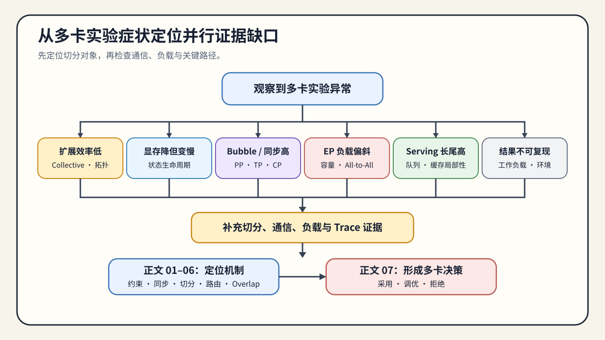

# 通信与并行问题排查手册

这份手册按多卡实验现象组织。第一次系统学习时，从[通信与并行问题链](./walkthrough.md)进入；已经遇到容量、同步、负载或扩展效率问题时，先在下表定位，再转到对应正文补证据。

## 使用方式

1. 先确认被切分的是训练状态、层、张量、上下文、专家还是请求。
2. 再检查 Collective、Payload、调用频率、拓扑和负载是否匹配该切分。
3. 最后用暴露通信与固定工作负载复测，形成采用、调优或拒绝结论。

## 症状索引

| 现象 | 优先检查 | 需要补充的证据 | 转到哪一页 |
|:---|:---|:---|:---|
| 卡数增加但吞吐没有明显提高 | Collective、Payload、拓扑与最慢 rank | 调用次数、有效带宽、max-rank time、扩展效率 | [02 数据并行与同步](./02_data_parallel_and_synchronization.md)、[06 Profiling 与 Overlap](./06_communication_profiling_and_overlap.md) |
| 显存下降但 step time 变差 | 参数临时聚合、通信 buffer、offload 与 checkpoint | 生命周期峰值、All-Gather/Reduce-Scatter、step time | [03 状态分片与 ZeRO](./03_state_sharding_and_zero.md) |
| Pipeline 能运行但 bubble 很大 | stage 划分、micro-batch 与依赖时序 | 每 stage 时间、活跃槽位、bubble ratio | [04 模型、上下文与请求切分](./04_pipeline_and_tensor_parallel.md) |
| TP 或 CP 的通信随规模迅速增加 | Head/张量布局、序列切分与同步频率 | Collective bytes、调用次数、上下文长度 sweep | [04 模型、上下文与请求切分](./04_pipeline_and_tensor_parallel.md)、[06 Profiling 与 Overlap](./06_communication_profiling_and_overlap.md) |
| EP 出现 overflow 或吞吐抖动 | capacity、路由偏斜、dispatch/combine | expert counts、dropped tokens、All-to-All bytes、max/mean load | [05 专家并行与动态路由](./05_expert_parallel_and_communication_hotspots.md) |
| Serving 副本平均负载正常但 P99 恶化 | 队列、路由、缓存局部性和实例热点 | per-replica queue、cache hit、TTFT/TPOT、P95/P99 | [04 模型、上下文与请求切分](./04_pipeline_and_tensor_parallel.md)、[07 Benchmark 与决策](./07_benchmark_and_parallel_decision.md) |
| 通信总时长很高但端到端时间变化不大 | 通信是否已被计算覆盖 | Trace 时间线、暴露通信、关键路径 | [06 Profiling 与 Overlap](./06_communication_profiling_and_overlap.md) |
| 单次 Benchmark 好看但结果不可复现 | 模型、输入、拓扑、并行度和测量协议 | 固定契约、重复运行、原始结果与失败记录 | [07 Benchmark 与决策](./07_benchmark_and_parallel_decision.md) |

## 排查路径

### 先验证切分是否解决了原始约束

状态分片应减少训练状态常驻量，模型内部并行应让目标层、张量或上下文能够执行，副本扩展应增加请求处理容量。若原始约束没有改善，继续调通信参数没有意义。

### 再解释通信为什么进入关键路径

把交换对象、单次字节数、调用频率和依赖位置写清楚，再结合拓扑和 max-rank 时间判断瓶颈。总通信量大不一定拖慢步骤；没有被有效计算覆盖的部分才直接延长关键路径。

### 最后检查负载和测量协议

PP 的 stage、EP 的专家、Serving 的副本都可能出现不均衡。平均值会隐藏热点，因此需要保留每 rank 或每实例数据，并在相同模型、输入和硬件条件下比较基线与候选。

## 何时进入最终决策

至少具备以下信息后，再进入正文 07：

- 可解释的单卡约束和切分对象；
- world size、进程组、拓扑和并行度；
- Collective、Payload、调用频率与暴露通信；
- 正确性或质量结果、容量、吞吐或延迟指标；
- 每 rank/实例负载、失败记录和重复运行结果。

证据不足时回到 01–06 补测；证据完整后进入 [07 Benchmark 与并行决策](./07_benchmark_and_parallel_decision.md)形成采用、调优或拒绝结论。
