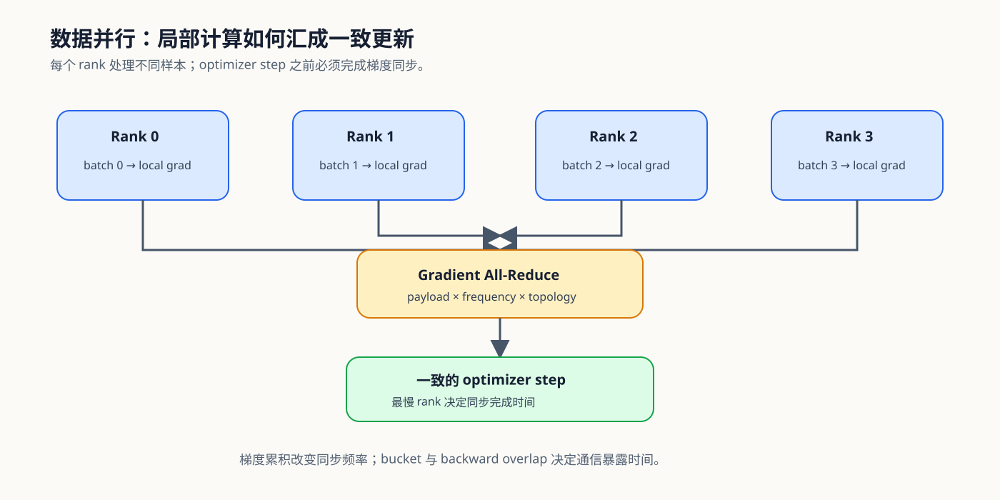
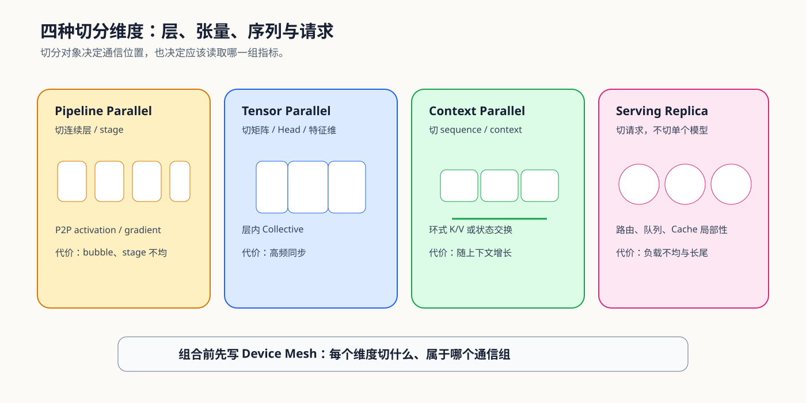
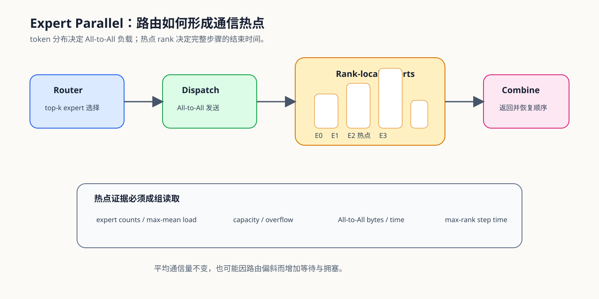

# 通信与并行问题链：从切分对象到多卡决策

多卡并行不是单纯增加设备，而是把原本位于单卡内部的状态与计算拆开，再通过通信恢复正确结果。学习时应沿着同一条因果链推进：

`单卡约束 → 切分对象 → Collective 与 Payload → 同步和负载 → 暴露通信 → 扩展效率与决策`

正文页解释单个机制，本页负责把训练状态、模型内部切分、专家路由和分布式推理连接起来。

## 图册与知识地图

路线图用于选择 Task 分支，知识地图用于回查切分对象、通信原语和结果证据之间的关系；局部机制图放在对应正文附近。

## 第一段：从单卡约束选择切分对象

先判断限制来自训练状态、模型深度、单层宽度、长上下文、专家规模还是请求规模。不同对象分别对应 ZeRO/FSDP、PP、TP、CP、EP 和 Serving Replica；切分对象没有确定时，不能仅凭框架参数选择并行方案。

对应 [01 为什么需要并行与通信](./01_why_parallel_and_communication.md)。

## 第二段：用 Collective、Payload 与拓扑解释同步

切分后要确认交换语义：All-Reduce 返回完整聚合结果，Reduce-Scatter 留下分片，All-Gather 恢复完整输入，All-to-All 按目标 rank 重排数据，P2P 连接指定阶段。实际代价同时取决于 payload、调用频率、world size 和拓扑。

对应 [02 数据并行与同步](./02_data_parallel_and_synchronization.md)。数据并行提供最基础的同步基线，也为后续状态分片和模型切分建立通信语言。

## 第三段：区分训练状态分片与模型内部切分

DDP、FSDP 和 ZeRO 改变参数、梯度和优化器状态的复制方式；PP、TP 与 CP 则分别切层、张量和上下文。前者重点检查常驻状态、临时聚合和 checkpoint 生命周期，后者重点检查 bubble、层内同步、Head 布局与序列通信。

对应 [03 状态分片与 ZeRO](./03_state_sharding_and_zero.md)和[04 模型、上下文与请求切分](./04_pipeline_and_tensor_parallel.md)。Serving Replica 也切请求，但路由、队列和缓存局部性属于服务侧证据，不能套用训练 DP 的梯度同步结论。

## 第四段：把专家并行看成动态通信

EP 的 payload 不是固定张量布局决定的，而是由本批次路由结果决定。route、capacity、dispatch、expert compute 和 combine 共同形成 All-to-All、overflow 与热点 rank；平均负载正常也不代表最慢 rank 不会拖慢全局步骤。

对应 [05 专家并行与动态路由](./05_expert_parallel_and_communication_hotspots.md)。

## 第五段：从通信总时长转向暴露通信

所有 NCCL Kernel 的总时长不能直接解释 step 或请求变慢。需要把 Collective 放回时间线，检查哪些通信已被有效计算覆盖、哪些仍位于关键路径，并同时观察 max-rank 时间、调用频率和负载不均。

对应 [06 通信 Profiling 与 Overlap](./06_communication_profiling_and_overlap.md)。

## 第六段：按四类项目形成决策

训练状态并行、模型内部并行、MoE 专家并行和分布式推理拥有不同指标，但都要固定模型、输入、硬件、拓扑和执行条件。最终结论应同时解释容量收益、通信代价、系统输出和失败范围，而不是只报告“多卡能够运行”。

对应 [07 Benchmark 与并行决策](./07_benchmark_and_parallel_decision.md)。遇到具体异常时，使用[通信与并行问题排查手册](./casebook.md)回到对应机制页。
