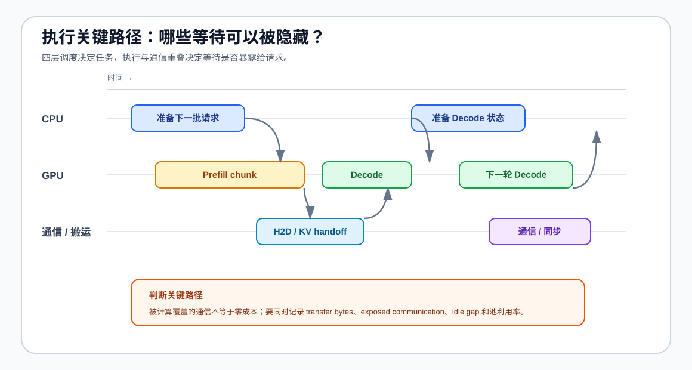

# 07. Serving Scheduling, PD, and Heterogeneous Routing | Serving 调度、PD 与异构路由

## 页面目标

从多个请求同时到达开始，观察 Prefill 和 Decode 如何争用计算、显存与队列资源；再逐层理解 Chunked Prefill、PD 分离、状态交接与异构资源路由如何共同影响服务质量。最后把调度决策放回 CPU 准备、GPU 计算和通信交接的时间线上，判断等待是否暴露在关键路径。

## 调度问题的四个层次

本节把“调度”按决策范围逐层展开。前一层决定当前一步做什么，后一层决定更多请求如何共享资源；因此 36、37、38 不是三个并列的 backend 名词，而是从执行单元走向服务拓扑的学习顺序。

| 层次 | 调度者在决定什么 | 主要输入 | 主要结果 | 对应入口 |
|:---|:---|:---|:---|:---|
| 单步 Decode 调度 | 当前 Decode step 给哪些活跃请求分配 token 计算 | 请求状态、优先级、剩余长度 | 本轮执行顺序与步数 | 36 |
| Cache 资源调度 | 请求能否继续占用 Cache，何时暂停、驱逐或恢复 | Cache 容量、Block、等待时间 | 可接纳请求数与公平性 | 37 |
| 批次与队列调度 | 哪些 Prefill / Decode 请求组成下一批 | 到达时间、Prompt 长度、Decode 工作量 | 批次效率、排队和尾延迟 | 38 的前置机制、70 的实验 |
| 服务池调度 | 请求进入哪个实例、Prefill 池或 Decode 池 | GPU 资源、链路、服务等级 | 服务吞吐、P99 和资源隔离 | 38、70 |
| 异构 PD 路由 | 交接 KV、重算 Prefill，还是保持同池 | 两池能力、状态大小、链路、SLO | 交接代价、池利用率、回退动作 | 39；分布式扩展见 Task6 的 79–81 |

## 执行关键路径与重叠

四层调度先决定请求、Cache、批次和资源池；执行级与通信级再回答这些决定如何落到时间线上。CPU 准备、GPU 计算、数据搬运和 KV 交接如果连续排队，就会把等待暴露给请求；如果能够安全重叠，才可能降低关键路径上的空洞。这里先建立共同判断方法，Task4 的局部实现分别在 38、39、70 中验证；跨 GPU 或跨实例的通信证据留到 Task6 的 79–81。

执行级和通信级不是新的请求状态，而是调度决策的时间维度：执行级关注 CPU 准备、GPU 计算和数据搬运能否重叠；Task4 只观察局部 handoff 是否暴露在关键路径，集合通信和多卡通信证据则连接到 Task6 的 79–81。相关底层入口仍包括 Part 02 的异步执行和 Part 04 的 Stream / Graph。

| 时间层次 | 调度要安排什么 | 典型策略 | 关键证据 |
|:---|:---|:---|:---|
| 执行级 | CPU 准备、GPU 计算、搬运和收尾的先后与重叠 | 双流、双线程、流水线 | overlap ratio、idle gap、端到端延迟 |
| 通信级 | 状态传输或集合通信与计算的重叠 | KV handoff、communication-compute overlap、DBO 类批次拆分 | transfer bytes、通信暴露时间、池利用率 |

读图时先区分两种时间：`total elapsed` 是请求真正等待的时间，`overlap` 是被其他工作隐藏的时间。只有通信或搬运从关键路径中移开，吞吐或尾延迟才可能改善；单纯增加并行任务而造成同步、争用或池闲置，不应直接判断为优化。

| 观察对象 | 需要回答的问题 | 证据字段 |
|:---|:---|:---|
| 请求进入 | 请求是在排队，还是在等待输入准备？ | `queue_wait_ms`、`input_transfer_ms` |
| CPU / GPU 重叠 | CPU 准备是否填补了 GPU 空闲间隙？ | `idle_gap`、`overlap_ratio`、端到端延迟 |
| KV handoff | 状态传输是否阻塞 Decode？ | `transfer_bytes`、`handoff_ms`、`recompute_ms` |
| 网络与集合通信 | 数据是否在通信路径上暴露出来？ | `network_wait_ms`、`communication_ms`、`exposed_comm_ms` |
| 模型启动与流式输出 | 冷启动或输出发送是否被误算为热请求性能？ | `model_load_ms`、`stream_output_ms`、`cold_start` |
| 池间平衡 | 一侧加速是否造成另一侧等待或闲置？ | Prefill / Decode 池利用率、P95/P99 |

### Task4 的 I/O 证据契约

I/O 在本节中不是另一个独立优化对象，而是解释调度结果为什么出现的证据层。先按时间位置区分等待、搬运和计算，再把同一组字段带入 70 的 serving benchmark；不要把模型加载、请求排队和 KV 交接相加后直接当成 TPOT。

| 证据阶段 | 记录什么 | 与调度的关系 | 解释时的注意点 |
|:---|:---|:---|:---|
| 请求进入 | `queue_wait_ms`、`input_transfer_bytes`、`input_transfer_ms` | 反映接纳、排队与输入准备 | 排队时间上升不等于 GPU 变慢 |
| Prefill / Decode 执行 | `idle_gap`、`overlap_ratio`、`stream_output_ms` | 判断准备、计算和输出是否重叠 | 只能用同一 workload 比较 |
| PD / KV 交接 | `transfer_bytes`、`handoff_ms`、`recompute_ms` | 判断传输、重算或同池回退的代价 | handoff 与 recompute 不能重复计入 |
| 网络 / 通信 | `network_wait_ms`、`communication_ms`、`exposed_comm_ms` | 判断通信是否暴露在关键路径 | 暴露时间应和总 elapsed 分开记录 |
| 启动阶段 | `model_load_ms`、`cold_start` | 区分扩容或首次请求成本 | 冷启动不能和热请求 TTFT 混合平均 |

70 负责把这些字段放入同一份 baseline / candidate 结果记录，并继续使用 `accept / tune / reject` 做决策；07 只规定字段语义和归因顺序，不替代 backend 的 profiler 或服务端日志。

这里要区分三个容易混淆的对象：

- **请求调度**决定“先服务谁、这一轮服务谁”；
- **Cache 管理**决定“请求的状态放在哪里、能保留多久”；
- **PD 分离**决定“Prefill 和 Decode 由哪个资源池执行”；
- **异构路由**决定“两池能力不同时，状态怎样交接、何时回到同池”。

三者可以协同，但改动一个对象并不等于同时完成另外两个对象的优化。例如扩大 Cache 容量可能提高可接纳并发，却不会自动改善队列公平性；把 Prefill 和 Decode 拆成两个池，也需要重新检查跨池通信和负载平衡。

当请求量超过当前资源能够稳定处理的范围时，调度器还要做“是否接纳”的决定。接纳控制不是简单拒绝请求，而是根据 Cache 预算、队列等待、服务等级和预计工作量选择排队、限流、降级或转移。它决定系统是在负载上升时保持 P99，还是让所有请求一起变慢。

| 接纳动作 | 触发条件 | 保护对象 | 需要观察 |
|:---|:---|:---|:---|
| 排队 | 当前资源短时不足，但预计可以恢复 | 请求完整性 | queue time、P99、队列长度 |
| 限流或拒绝 | 队列或 Cache 超过安全水位 | 已接纳请求的 SLA | rejection rate、超时率、P99 |
| 降级 | 质量目标允许降低资源开销 | 整体可用性 | 输出长度、dtype、质量指标 |
| 转移或扩容 | 单实例或单池持续饱和 | 服务容量 | 利用率、迁移/通信时间、吞吐 |

## 核心机制

Serving 调度面对的不是单个算子，而是请求之间的资源竞争。先用“单 backend、基础批处理、单实例、不开启 PD 分离”的 Serving 配置建立参考行为，固定请求分布、并发度和输出长度，记录 TTFT、TPOT、吞吐、P99 与峰值显存。Prefill 通常带来突发计算和显存申请，Decode 则需要持续、稳定地读取 KV Cache；如果把两者简单混在同一批次，长 Prompt 可能阻塞正在生成的请求。因此需要分别观察批处理、队列、Cache 预算和 GPU 资源分配。

vLLM 和 SGLang 都是 Serving backend，但它们适合观察的机制重点不同：vLLM 适合作为统一基线，关注 PagedAttention、连续批处理和调度；SGLang 更适合观察 RadixAttention、前缀复用、结构化程序和 PD 分离。下面的图片先说明共同的请求链路，再对照两种 backend 的侧重点。

| Backend | 重点机制 | 更适合观察的问题 | 对应项目 |
|:---|:---|:---|:---|
| 单 backend 基线 | 基础批处理、单实例、不开启 PD 分离 | 建立 TTFT、TPOT、吞吐、P99 和峰值显存参照 | 66 的基础 Serving 配置 |
| vLLM | PagedAttention、连续批处理、请求调度 | Cache 分配、吞吐、TTFT / TPOT、P99 | 66 基线与 backend 对照、70 调度 |
| SGLang | RadixAttention、前缀复用、结构化执行、PD 分离 | Prefix Cache、共享前缀、请求组织与资源拆分 | 66 可选对照、69 缓存、70 调度 |

| 机制 | 主要解决的问题 | 观察指标 |
|:---|:---|:---|
| Continuous Batching | 请求到达时间不同、生成长度不同 | 吞吐、TPOT、P99 |
| Chunked Prefill | 单次长 Prefill 阻塞其他请求 | TTFT、P99、Decode 抖动 |
| Prefill / Decode 分离 | 两类计算互相争用资源 | TTFT、TPOT、P95、池利用率 |
| 异构 PD 路由 | 两池能力、链路或 backend 不同 | handoff ms、传输量、重算时间、P99、失败状态 |
| 队列与资源调度 | 并发、容量和服务等级变化 | 排队时间、并发容量、SLA |

把 Serving 调度看成一个闭环：请求进入队列后，系统根据可用 Cache、Prefill/Decode 计算预算和服务等级选择下一批请求；运行结果再反馈给下一轮调度。这样可以把“调度策略更好”拆成可观察的资源账本和服务结果，而不是只看 GPU 利用率。

| 调度决策依据 | 影响的系统对象 | 需要观察的结果 |
|:---|:---|:---|
| 等待时间与服务等级 | 队列顺序、请求公平性 | P50/P99、最大等待时间、超时率 |
| Prompt / Decode 工作量 | Prefill 与 Decode 的批次组成 | TTFT、TPOT、批次利用率 |
| Cache 可用容量 | 是否接纳、暂停或驱逐请求 | Cache 使用量、OOM、并发容量 |
| 实例与链路状态 | 单实例、PD 池和跨设备通信 | 吞吐、通信时间、资源利用率 |
| 状态交接预算 | KV 传输、重算或保持同池 | handoff ms、recompute ms、P99 |

学习和实验时按同一顺序推进：先用 36 验证单步请求选择，再用 37 加入 Cache 容量和暂停/恢复，用 38 观察 Chunked Prefill、分池与交接预算，再用 39 判断异构资源的路由、KV 传输/重算和 SLO 回退，最后在 70 中固定 workload 比较 TTFT、TPOT、throughput、P99、并发容量、公平性与池利用率。这样得到的结论才能说明“哪一层调度改善了什么”，而不是只报告 GPU 利用率变化。

多 GPU 和自动扩缩容不属于本节的主体，而是 Task6 的后续扩展。它们不改变前面的四层调度定义；完成单实例调度验证后，再进入并行机制、跨 GPU / 跨实例通信、负载平衡和部署成本的比较。

| 扩展方向 | 新增约束 | 需要补充的证据 | 后续入口 |
|:---|:---|:---|:---|
| Tensor / Pipeline / Expert Parallel | 分片、同步和负载平衡 | 通信时间、空转、吞吐、显存 | Task6：79–81、分布式专题 |
| MoE Expert Parallel | token dispatch、专家容量和负载不均 | expert load、通信时间、空转、吞吐 | Task6：80；Part 01 · 22 |
| PD 多实例 | 跨池传输和池间负载不均 | transfer time、池利用率、P99 | Task4 基础：38、70；Task6 扩展：79–81 |
| 异构 PD | 资源能力、链路或 backend 不同 | handoff / recompute、路由命中、P99、回退率 | Task4 基础：39；Task6 扩展：79–81 |
| 自动扩缩容 | 冷启动、迁移和容量预测 | 扩容延迟、恢复时间、拒绝率 | 性能分析与部署专题 |

参考入口：开源项目 [vLLM](https://github.com/vllm-project/vllm) 与 [SGLang](https://github.com/sgl-project/sglang)；论文 [SGLang](https://arxiv.org/abs/2312.07104) 和官方文档 [PD Disaggregation](https://github.com/sgl-project/sglang/blob/main/docs_new/docs/advanced_features/pd_disaggregation.mdx)。

## 判断框架

本节承接 `04` 的 Cache 资源边界，先阅读 [37 KV Cache Scheduling](../../02_PyTorch_Algorithms/37_KV_Cache_Scheduling.ipynb)、[38 Prefill/Decode 调度](../../02_PyTorch_Algorithms/38_Prefill_Decode_Scheduling.ipynb) 与 [39 异构 PD 与服务分层](../../02_PyTorch_Algorithms/39_Hetero_PD_and_Serving_Tiers.ipynb)，再通过 [70 Serving Scheduler Benchmark](../../02_PyTorch_Algorithms/70_Serving_Scheduler_Benchmark.ipynb) 观察真实请求 workload。阅读下表时，先固定请求分布、Prompt 长度、generated tokens、并发度、batch 策略和 Cache policy，再区分计算、排队、交接与资源分配问题。

| 观察到的现象 | 优先判断 | 下一步 |
|:---|:---|:---|
| 长 Prompt 到达后 Decode 请求明显抖动 | Prefill 抢占或批次组织不合理 | 检查 Chunked Prefill 和 Continuous Batching |
| TTFT 可接受但 TPOT / P99 变差 | Decode 资源被挤占或排队积累 | 检查 Decode 调度和资源配额 |
| 单实例无法同时满足两类请求 | Prefill 与 Decode 资源需求不同 | 评估 Chunked Prefill 与 PD 分离 |
| PD 吞吐改善但 P99 变差 | 交接或池间失衡暴露在关键路径 | 比较 KV 传输、重算与同池回退 |
| GPU 利用率低但排队时间高 | 调度粒度、批次或跨实例通信不合理 | 进入 profiling 和 serving benchmark |
