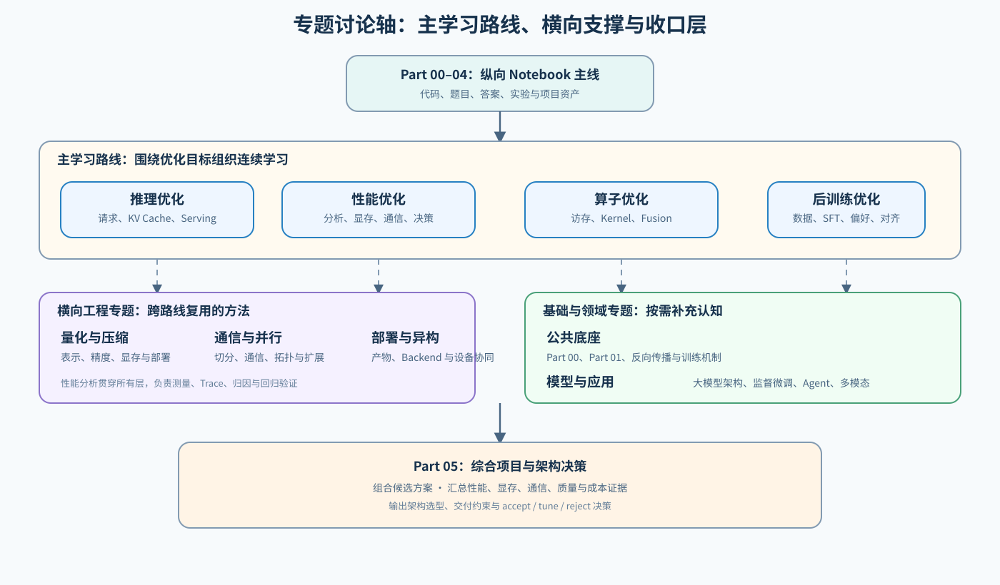

# 专题讨论轴

`topic_discussion` 是跨多个 Part 的知识组织与导航层。它不替代各 Part 中的 Notebook 学习内容，而是把分散的内容放回路线、方法和证据框架中。

它主要承担以下职责：

- 把各 `Part` 中分散的 Notebook 和项目组织成清晰的路线入口；
- 为跨路线反复出现的方法轴提供统一的判断框架；
- 为基础机制、项目指标和专题边界补充背景解释，帮助读者理解结论来自什么机制、需要什么证据。

## 入口与专题层级

专题轴不是另一条线性课程，而是把纵向 Part、四条主学习路线、横向工程能力和基础/领域入口组织在一起。没有明确问题时，可以从四条主路线中选择；已经知道瓶颈对象时，直接进入对应的横向专题或基础支撑专题。

专题页负责组织关系和学习入口，具体机制、题目和实验仍以对应 Part 的 Notebook 为准。主路线关注优化目标，横向专题关注通用方法，基础与领域专题提供认知和应用背景，最终由 Part 05 收口到综合项目和架构决策。

### 主学习路线

| 路线 | 主入口 | 主要回答的问题 |
|:---|:---|:---|
| 推理优化 | [推理优化（Inference Optimization）](./inference_optimization/intro.md) | 请求、Prefill、Decode、KV Cache、Serving 如何协同提升端到端推理性能？ |
| 性能优化 | [性能优化（Performance Optimization）](./performance_optimization/intro.md) | 性能分析、显存管理、通信代价和成本决策如何串成证据链？ |
| 算子优化 | [算子优化（Operator Optimization）](./operator_optimization/intro.md) | 如何从访存、Kernel、Fusion 和执行约束提升局部与端到端性能？ |
| 后训练优化 | [后训练优化（Post-Training Optimization）](./post_training_optimization/intro.md) | 如何从监督微调走向偏好数据、DPO、GRPO 和对齐项目？ |

### 横向工程专题

| 专题 | 主入口 | 主要作用 |
|:---|:---|:---|
| 显存优化 | [显存优化（Memory Optimization）](./memory_performance_tuning/intro.md) | 深入理解 VRAM、Activation、Checkpoint、Offload、KV Cache 和资源权衡。 |
| 性能分析 | [性能分析（Performance Analysis）](./profiling/intro.md) | 提供跨训练、推理和系统层的测量、Trace 和瓶颈归因方法。 |
| 量化与压缩 | [量化与压缩（Quantization and Compression）](./quantization/intro.md) | 比较表示压缩、精度、显存、吞吐和部署格式。 |
| 通信与并行 | [通信与并行（Communication and Parallelism）](./communication_parallel/intro.md) | 解释多卡切分、通信原语、拓扑和扩展效率。 |
| 部署与异构 | [部署与异构系统（Deployment and Heterogeneous Systems）](./deployment_heterogeneous/intro.md) | 组织模型产物、Backend、设备协同和部署验证。 |

### 基础与领域专题

基础专题包括[反向传播与训练机制](./backpropagation_training_mechanism/intro.md)、[大模型架构](./model_architecture/intro.md)和[SFT / LoRA 基础模块](./post_training_optimization/sft_foundation/intro.md)；图级优化与编译已经并入[算子优化](./operator_optimization/intro.md)的支撑模块；领域专题包括[多模态](./multimodal/intro.md)等。它们按需补充机制、模型结构、数据工程和应用背景，不要求在主路线之前全部学完。

### 收口层

[Part 05：综合项目与架构决策](../05_Integrated_Projects_and_Decisions/intro.md)负责把多条路线的证据汇总到一个工程问题中，完成方案组合、成本估算、架构选型和最终交付判断。

## Infra 层与证据维度

### LLM Infra 五层总览

横向专题统一放回下面这套从下到上的 Infra 结构理解：

| 层级 | 主要内容 | 核心问题 | 边界判断 |
|:---|:---|:---|:---|
| Infra-L1 硬件与基础设施 | GPU/NPU、CPU、HBM、PCIe、NVLink、InfiniBand、SSD | 物理资源提供了什么能力？ | 改的是芯片、容量、带宽、拓扑或物理设备 |
| Infra-L2 系统软件与加速库 | 驱动、CUDA/ROCm、编译器、Triton、NCCL、cuBLAS、FlashAttention | 如何把硬件能力调用出来？ | 改的是 kernel、算子、编译、通信原语或设备运行时 |
| Infra-L3 框架与运行时 | PyTorch、JAX、FSDP、DeepSpeed、Megatron、训练运行时 | 模型计算和状态如何组织？ | 改的是计算图、自动求导、并行切分、状态管理或执行调度 |
| Infra-L4 服务与模型优化 | vLLM、SGLang、TensorRT-LLM、量化、KV Cache、Serving 调度 | 一个模型实例如何高效执行？ | 改的是模型加载、请求处理、缓存、实例吞吐和延迟 |
| Infra-L5 平台与 MLOps | 资源调度、模型仓库、灰度发布、监控、告警、工作流 | 多个模型和用户如何稳定交付？ | 改的是资源编排、版本生命周期、流量治理和服务可用性 |

模型、数据和 workload 不是独立的一层，而是运行在这五层之上的负载面：训练主要落在 Infra-L3，推理主要落在 Infra-L4，最终都受 Infra-L1/Infra-L2 的硬件与系统软件约束。

层间存在灰色地带。例如，FlashAttention 的算法思想属于方法层，kernel 实现属于 Infra-L2，服务集成属于 Infra-L4；FSDP / DeepSpeed 属于 Infra-L3，但底层会调用 Infra-L2 的 NCCL，集群资源又由 Infra-L5 管理；量化理论属于算法方法，低比特 kernel 属于 Infra-L2，推理部署属于 Infra-L4，模型版本和发布流程属于 Infra-L5。KV Cache 的数据结构和调度主要在 Infra-L3/Infra-L4，显存容量和带宽受 Infra-L1 约束，监控和扩缩容则属于 Infra-L5。

Profiling 不属于某一个固定层，而是贯穿 Infra-L1–Infra-L5 的证据工具。它把硬件利用率、kernel 时间、框架调度、服务请求和平台资源放到同一条证据链中；因此一个优化结论不能只说“某层变快了”，还要说明它对 `Compute / Memory / Communication / Quality / End-to-End` 的影响。

### 横向能力轴

五层结构回答“组件位于哪里”，还需要三条横向能力轴回答“代价如何产生”：

- `Compute`：FLOPs、kernel 时间、利用率和计算重叠。
- `Memory`：容量、带宽、数据驻留、缓存和访存次数。
- `Communication`：GPU 间、CPU-GPU 间、节点间传输、同步和拓扑。

Profiling 与 Evaluation 横跨五层：前者负责采集证据，后者负责验证质量、性能、显存、通信和部署结果。每个优化结论至少要说明 `Compute Δ / Memory Δ / Communication Δ / Quality Δ / End-to-End Δ`。

## 路线选择与运行环境

### 如何选择主路线

四条主路线是并列入口，不代表学习顺序。先按问题表现选择入口，再根据定位结果进入相关横向专题。

| 如果你主要遇到 | 优先进入 | 重点观察 |
|:---|:---|:---|
| 请求延迟、吞吐、并发或服务调度 | 推理优化 | TTFT、TPOT、吞吐、P99、KV Cache |
| OOM、activation、optimizer state 或显存预算 | 性能优化 → Task2 | peak memory、带宽、重算、搬运、OOM 边界 |
| 单个 kernel 慢、访存低效或融合收益不明显 | 算子优化 | kernel time、带宽利用率、occupancy、端到端收益 |
| SFT 后的偏好、奖励、DPO 或 GRPO 问题 | 后训练优化 | 偏好质量、任务指标、稳定性、训练代价 |

这里的 Infra 层表示问题主要发生的位置，不表示路线等级或学习先后。需要跨层定位时，再结合 Profiling、量化与压缩、通信与并行等横向专题。

### 运行环境

项目的运行环境由硬件、运行方式和依赖配置三部分组成：

| 硬件 | 运行方式 | 依赖配置示例 |
|:---|:---|:---|
| CPU | Python / PyTorch 逻辑验证 | base.txt + torch-cpu.txt |
| 单 GPU | Transformers / PyTorch 训练或本地推理 | fine-tuning.txt + torch-cu128.txt |
| 单 GPU | vLLM / SGLang 真实推理服务 | inference-vllm.txt 或 inference-sglang.txt |
| 多 GPU | PyTorch Distributed / 分布式服务 | distributed.txt + torch-cu128.txt |

“单 GPU”和“真实 backend”不是递进等级：前者描述硬件，后者描述软件运行方式，两者可以同时成立。没有对应硬件时可以完成逻辑验证，但不能把模拟结果当作真实性能结论。

### 常见问题跳转

如果还没有定位问题，先选择一条主路线；如果已经知道问题属于某个方法轴，再进入横切支撑专题；如果需要补机制背景，再回看基础支撑专题。

常见跳转：

- `偏好数据 / DPO / GRPO / 对齐项目` -> [后训练优化专题](./post_training_optimization/intro.md)
- `结构前置 / SFT / LoRA / 训练工程` -> [SFT / LoRA 基础模块](./post_training_optimization/sft_foundation/intro.md)
- `prefill / decode / PagedAttention / benchmark` -> [推理优化](./inference_optimization/intro.md)
- `VRAM / checkpoint / offload / memory trade-off` -> [显存优化](./memory_performance_tuning/intro.md)
- `量化是否值得做` -> [量化与压缩](./quantization/intro.md)
- `为什么慢、为什么爆显存、证据怎么拿` -> [性能分析](./profiling/intro.md)
- `多卡通信和并行切分怎么判断` -> [通信与并行](./communication_parallel/intro.md)

## 专题分工与项目复用

### 能力与组件边界

这些内容连接五层结构，但承担的角色不同：算子优化是主路线，图级优化与编译是其 Task1 支撑模块，通信与并行是横切支撑，MLSys 是跨专题的方法框架，不是独立的第 12 个专题。

| 能力 | 主要连接 | 在专题中的展开位置 | 当前项目入口 |
|:---|:---|:---|:---|
| 算子优化 | Infra-L1–Infra-L3 | [算子优化](./operator_optimization/intro.md)、[Part 03](../03_Triton_Kernels/intro.md)、[Part 04](../04_CUDA_and_System_Optimization/intro.md)；必要时用 [Part 02 · 74 Profiling](../02_PyTorch_Algorithms/74_Profiling_Driven_End_to_End_Optimization.ipynb) 验证 kernel 对端到端结果的影响 | [Part 03](../03_Triton_Kernels/intro.md) / [Part 04](../04_CUDA_and_System_Optimization/intro.md) |
| 图级优化与编译 | Infra-L2–Infra-L3 | [算子优化支撑模块](./operator_optimization/graph_compiler/intro.md)，负责图变换、IR、lowering 和 backend 决策 | [Part 03](../03_Triton_Kernels/intro.md) / [Part 04](../04_CUDA_and_System_Optimization/intro.md) |
| 异构并行与通信 | 主要连接 Infra-L1–Infra-L3；资源编排延伸到 Infra-L5 | 通信与并行；性能分析负责定位计算、内存、通信等待 | [Part 02 · 79 分布式并行](../02_PyTorch_Algorithms/79_Distributed_Parallel_Benchmark.ipynb) / [Part 02 · 80 MoE 专家并行](../02_PyTorch_Algorithms/80_MoE_Expert_Parallel_Benchmark.ipynb) / [Part 02 · 81 分布式推理](../02_PyTorch_Algorithms/81_Distributed_Inference_Project.ipynb) |
| MLSys 方法 | Infra-L2–Infra-L5 | 作为跨专题方法：约束建模、profiling、benchmark、资源调度和回归决策 | [Part 02 · 74 Profiling](../02_PyTorch_Algorithms/74_Profiling_Driven_End_to_End_Optimization.ipynb) / [Part 02 · 75 显存预算](../02_PyTorch_Algorithms/75_Memory_Budget_Compression_Project.ipynb) / [Part 02 · 79 分布式并行](../02_PyTorch_Algorithms/79_Distributed_Parallel_Benchmark.ipynb) |

库的归属按主要职责判断：NCCL 和算子库偏 Infra-L2，训练与并行框架偏 Infra-L3，服务和资源编排分别进入 Infra-L4、Infra-L5。专题不重复介绍同一个库，而是解释它在当前问题中的作用和代价。

### 多专题项目如何阅读

一个项目可以被多个专题复用，但只保留一个主叙事入口。主专题负责定义项目问题和最终结论，关联专题只复用其中的指标、机制或实验结果；例如 `66` 的主专题是推理优化，但量化、编译、显存和性能分析可以分别解释它的低比特、kernel、预算和证据视角。项目资产表中的“主专题 / 关联专题 / Infra 层”用于记录这种关系，避免把同一个项目误读成多个独立项目。

### 按需入口与基础支撑

这些入口不替代主路线，而是把跨路线反复出现的方法轴单独拉出来。性能优化负责把测量、资源和决策串起来；下面的专题负责深入某一类机制或工程手段：

**横切支撑专题**

| 专题 | 主入口 | 更适合什么时候进入 |
|:---|:---|:---|
| 量化与压缩 | [量化与压缩（Quantization and Compression）](./quantization/intro.md) | 当你同时要看精度、显存、带宽和部署取舍时 |
| 通信与并行 | [通信与并行（Communication and Parallelism）](./communication_parallel/intro.md) | 当你开始进入多卡训练、并行切分和通信瓶颈时 |
| 性能分析 | [性能分析（Performance Analysis）](./profiling/intro.md) | 当你需要拿证据，而不是只靠经验猜测时 |
| 部署与异构系统 | [部署与异构系统（Deployment and Heterogeneous Systems）](./deployment_heterogeneous/intro.md) | 当你要理解模型产物、backend、设备协同和部署交付时 |

**领域入口**

| 专题 | 主入口 | 更适合什么时候进入 |
|:---|:---|:---|
| 多模态 | [多模态（Multimodal）](./multimodal/intro.md) | 当你要把图像、文本等多种输入接入训练、推理和评测时 |

**基础支撑专题**

这些专题更偏机制解释和背景支撑，常作为主路线的前置桥。监督微调与训练工程是后训练优化的 V1 前置支撑，不再作为当前主路线入口：

| 专题 | 主入口 | 更常服务哪条路线 |
|:---|:---|:---|
| 反向传播与训练机制 | [反向传播与训练机制（Backpropagation and Training Mechanics）](./backpropagation_training_mechanism/intro.md) | 训练微调、显存优化 |
| 大模型架构 | [大模型架构（Model Architecture）](./model_architecture/intro.md) | 训练微调、推理优化 |
| SFT / LoRA 基础模块 | [SFT / LoRA 基础模块](./post_training_optimization/sft_foundation/intro.md) | 后训练优化、训练项目 |
| 图级优化与编译 | [算子优化支撑模块](./operator_optimization/graph_compiler/intro.md) | 算子优化、推理优化、系统优化 |
