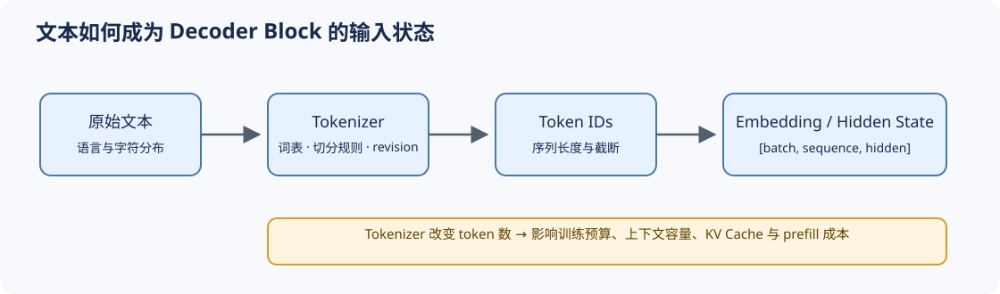

# 02 分词与输入表示（Tokenization and Embedding）

## 页面导语

模型看到的不是原始文字，而是 tokenizer 产生的 token id 及其 embedding。这个输入契约同时决定词表覆盖、序列长度、上下文预算和 Block 的 hidden size，是架构审计的起点。

## 1. 设计压力：词表覆盖与序列长度如何平衡？

词级切分容易产生未登录词和巨大词表，字符或字节级切分覆盖稳定但序列更长。Subword 方法在二者之间建立折中，并把文本处理变成可复现的模型资产。

| 表示粒度 | 优势 | 主要代价 |
|:---|:---|:---|
| 词级 | 序列较短、语义单位直观 | 词表膨胀，稀有词与多语言覆盖差 |
| Subword | 词表与长度较均衡，工程成熟 | 切分仍依赖训练语料与规则 |
| 字符 / 字节 | 开放词表、跨语言覆盖稳定 | 序列增长，训练和推理成本上升 |

## 2. 结构机制：token id 如何进入模型？

Tokenizer 固化词表和切分规则，embedding table 将 token id 映射到 `hidden_size` 维向量，位置机制再把顺序信息注入 Attention。输入 embedding 与输出词表头还可能共享权重，因此 tokenizer、hidden size 和输出空间并不是彼此孤立的配置。

## 3. 取舍与证据：同一文本并不等于同一 workload

比较模型时必须同时记录 tokenizer revision、token 数和上下文截断策略。相同文本在不同 tokenizer 下可能产生不同长度，进而改变训练 token 预算、KV Cache 容量、prefill 延迟与计费结果。

## 4. 代码与项目入口

- [Part 00 · 16 Attention 入门](../../00_Prerequisites/16_Attention_Mechanism_Intro.ipynb)：观察 token 表示进入 Attention 的最小路径。
- [Part 02 · 00 PyTorch 热身](../../02_PyTorch_Algorithms/00_PyTorch_Warmup.ipynb)：建立 token id、embedding 与张量形状契约。
- [Part 02 · 05 LLaMA3 Block](../../02_PyTorch_Algorithms/05_LLaMA3_Block_Tutorial.ipynb)：把输入状态接入完整 Block。

## 相关阅读

- [Neural Machine Translation of Rare Words with Subword Units](https://arxiv.org/abs/1508.07909)
- [SentencePiece](https://arxiv.org/abs/1808.06226)
- [ByT5](https://arxiv.org/abs/2105.13626)
