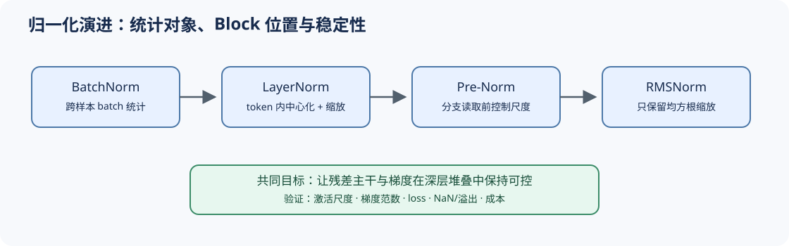

# 03 归一化演进（Normalization Evolution）

## 页面导语

归一化决定分支以什么尺度读取残差流，也影响梯度能否穿过深层网络。本页沿着 BatchNorm、LayerNorm、Pre-Norm 和 RMSNorm 的演进，解释现代 LLM 为什么倾向使用更轻量的尺度约束。

## 1. 设计压力：深层状态为什么会不稳定？

随着 Block 堆叠，激活尺度、残差累积和梯度传播会相互影响。序列模型又不适合依赖 batch 统计，因此归一化必须从“跨样本统计”转向“每个 token 的特征尺度”。

## 2. 结构机制：形式与位置共同决定梯度路径

| 方案 | 统计或变换 | 在 Block 中的作用 | 主要取舍 |
|:---|:---|:---|:---|
| BatchNorm | 依赖 batch 统计 | 稳定视觉网络激活 | 变长序列和小 batch 下不自然 |
| LayerNorm | 每个 token 做中心化与尺度归一 | 不依赖 batch，适配序列 | 包含均值计算与偏置路径 |
| RMSNorm | 只按均方根缩放 | 保留尺度约束，计算更简洁 | 不执行显式中心化 |
| Pre-Norm | 子层前归一化 | 残差主干更直接，深层优化通常更稳 | 子层输出仍会持续累积到残差流 |

RMSNorm 的关键不是“少一个公式”，而是检验中心化是否为当前表示所必需；Pre-Norm 的关键也不是代码顺序，而是为深层梯度保留更直接的残差路径。

## 3. 取舍与证据：轻量结构仍需稳定性验证

归一化选择应同时观察激活尺度、梯度范数、训练 loss、溢出/NaN 和推理成本。单次前向的算子减少不能替代训练稳定性证据；跨模型对比也不能把所有差异归因于 Norm。

## 4. 代码与项目入口

- [Part 00 · 15 归一化技术](../../00_Prerequisites/15_Normalization_Techniques.ipynb)：比较归一化轴和统计量。
- [Part 02 · 01 RMSNorm](../../02_PyTorch_Algorithms/01_RMSNorm_Tutorial.ipynb)：验证 LayerNorm 与 RMSNorm 的统计差异。
- [Part 02 · 05 LLaMA3 Block](../../02_PyTorch_Algorithms/05_LLaMA3_Block_Tutorial.ipynb)：观察 Pre-Norm 如何进入残差路径。
- [Part 02 · 60 Decoder Block 稳定性项目](../../02_PyTorch_Algorithms/60_Decoder_Block_Stability_Benchmark.ipynb)：记录深度、尺度和稳定性证据。

## 相关阅读

- [Layer Normalization](https://arxiv.org/abs/1607.06450)
- [Root Mean Square Layer Normalization](https://arxiv.org/abs/1910.07467)
- [DeepNet](https://arxiv.org/abs/2203.00555)
