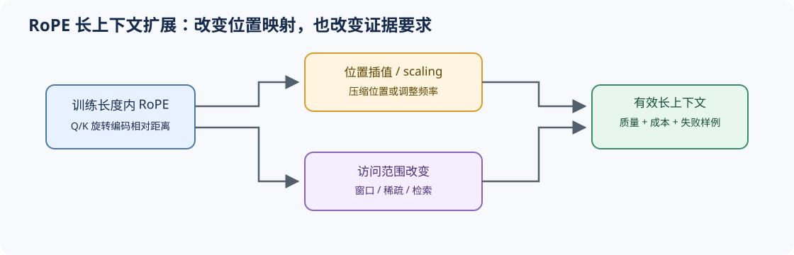

# 05 RoPE 与长上下文位置机制（RoPE and Long-Context Positioning）

## 页面导语

Attention 本身无法区分顺序。位置机制不仅要告诉模型“谁在前、谁在后”，还要决定模型在训练长度之外如何解释距离。本页从绝对位置、相对位置到 RoPE，再进入位置插值与 scaling 的证据边界。

## 1. 设计压力：顺序信息如何进入 Q/K？

绝对位置将位置向量直接加入输入，相对位置关注 token 间距离；RoPE 则旋转 Q/K，使注意力内积自然携带相对位置信息。长上下文扩展的困难在于：改变旋转频率可以延长可用范围，也可能破坏模型训练时形成的位置分布。

## 2. 结构机制：基频、维度与距离共同作用

| 路径 | 改变什么 | 主要收益 | 主要风险 |
|:---|:---|:---|:---|
| 绝对位置编码 | 输入位置向量 | 实现直观 | 固定表难以外推 |
| 相对位置偏置 | Attention score | 直接表达距离 | 形式与实现路径较多 |
| RoPE | Q/K 各维旋转角 | 与 Attention 紧密结合 | 超出训练长度后频率行为变化 |
| 插值 / scaling | 位置或频率映射 | 扩大可用上下文 | 短程分辨率和长程质量需重新验证 |

## 3. 取舍与证据：标称上下文不等于有效上下文

长上下文判断至少需要长度阶梯、训练长度内外标记、检索/推理质量、prefill 成本和 KV/state 容量。仅验证模型“能够接收”长输入，不能证明它仍能可靠利用远处信息。

## 4. 代码与项目入口

- [Part 02 · 03 RoPE](../../02_PyTorch_Algorithms/03_RoPE_Tutorial.ipynb)：实现旋转并观察不同频率维度。
- [Part 02 · 44 局部、滑动窗口与稀疏 Attention](../../02_PyTorch_Algorithms/44_Local_Sliding_and_Sparse_Attention.ipynb)：比较位置扩展与访问范围限制。
- [Part 02 · 77 长序列记忆架构基准](../../02_PyTorch_Algorithms/77_Long_Sequence_Memory_Architecture_Benchmark.ipynb)：记录长度阶梯上的质量与成本。

## 相关阅读

- [RoFormer](https://arxiv.org/abs/2104.09864)
- [ALiBi](https://arxiv.org/abs/2108.12409)
- [LongRoPE](https://arxiv.org/abs/2402.13753)
