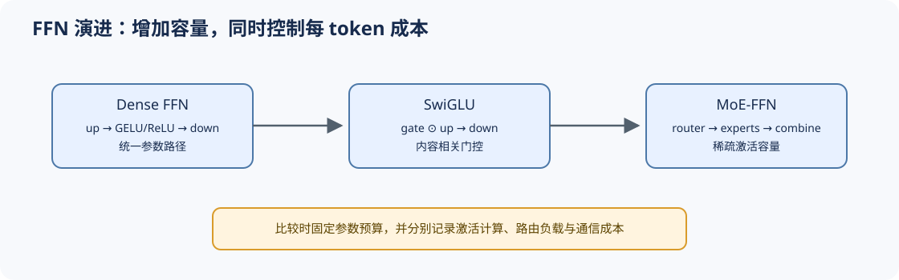

# 07 MLP / FFN 演进（MLP and FFN Evolution）

## 页面导语

Attention 负责 token 间交互，MLP/FFN 负责每个 token 的通道变换。它从两层线性网络演进到门控 FFN，再进一步成为 MoE 的专家主体。本页比较这些变化如何影响参数容量、激活计算与结构位置。

## 1. 设计压力：怎样增加逐 token 表达能力？

扩大 FFN hidden size 可以增加容量，也会同步增加参数、计算和内存访问。门控结构希望在相近预算下提升表达能力；MoE 则把“所有 token 使用同一组参数”改为“每个 token 激活部分专家”。

## 2. 结构机制：从单路径变换到门控与稀疏激活

| 结构 | 主要路径 | 容量与计算特征 |
|:---|:---|:---|
| ReLU / GELU FFN | `up → activation → down` | 所有 token 使用同一 dense 路径 |
| GLU / SwiGLU | `gate ⊙ up → down` | 增加内容相关门控，需要公平匹配参数预算 |
| MoE-FFN | `router → selected experts → combine` | 总参数增长快，单 token 只激活部分专家 |

比较 GELU 与 SwiGLU 时，应先匹配参数量或中间维度；否则提升可能来自更大容量，而不只是激活形式。

## 3. 取舍与证据：结构收益会转化为系统成本

Dense FFN 的执行规则稳定，MoE 则引入路由、容量上限、dispatch/combine 和跨设备通信。结构审计需要把“模型容量”与“每 token 激活计算”分开记录，并补充负载分布与 overflow 证据。

## 4. 代码与项目入口

- [Part 02 · 02 SwiGLU](../../02_PyTorch_Algorithms/02_SwiGLU_Activation.ipynb)：比较门控结构与参数容量。
- [Part 02 · 05 LLaMA3 Block](../../02_PyTorch_Algorithms/05_LLaMA3_Block_Tutorial.ipynb)：把 MLP 放回 Block。
- [Part 02 · 06 MoE Router](../../02_PyTorch_Algorithms/06_MoE_Router.ipynb)：由 dense FFN 进入专家选择。
- [Part 02 · 07 MoE 负载均衡](../../02_PyTorch_Algorithms/07_MoE_Load_Balancing_Loss.ipynb)：检查专家利用率与稳定性。

## 相关阅读

- [Gaussian Error Linear Units](https://arxiv.org/abs/1606.08415)
- [GLU Variants Improve Transformer](https://arxiv.org/abs/2002.05202)
- [Switch Transformers](https://arxiv.org/abs/2101.03961)
