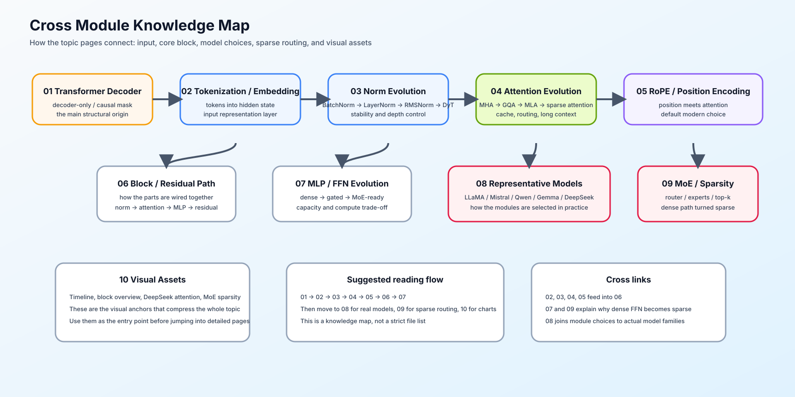

# 架构审计 Casebook

本页用于把模型卡、论文或配置文件中的结构描述转成可复查的判断。先定位替换发生在 Block 的哪个位置，再判断它改变了什么状态、计算或通信；不要从模型名称直接推导结论。

## 结构审计顺序

| 审计顺序 | 要确认的问题 | 记录的证据 |
|:---|:---|:---|
| 输入与主干 | token、embedding、position、residual 的路径是什么？ | 配置字段、张量形状、权重共享关系 |
| Attention 表示 | head、KV head 或 latent KV 如何变化？ | head 数、KV head 数、latent 维度、Cache 形式 |
| 位置与访问范围 | 位置如何进入 Q/K，哪些历史 token 可见？ | RoPE / scaling、mask、窗口或稀疏模式 |
| Norm 与 FFN | 归一化放在哪里，通道如何扩展？ | norm 类型、激活、intermediate size、残差顺序 |
| 容量与记忆机制 | token 是否路由；历史是否显式保存？ | top-k、capacity、expert 数、递推状态形状 |
| 系统影响 | 这项替换可能影响什么，需要怎样验证？ | 参数 / 计算 / 状态 / 通信估算与真实测量 |

## 常见现象与回查路径

| 看到的描述 | 先判断什么 | 回查入口 | 下一步证据 |
|:---|:---|:---|:---|
| “GQA / MQA / MLA” | Q head 与 KV 表示是否真的改变 | [04 Attention](./04_attention_evolution.md) | KV 状态大小、上下文质量、真实延迟 |
| “sliding window / sparse attention” | 每个 token 的可见范围是什么 | [Part 02 · 44](../../02_PyTorch_Algorithms/44_Local_Sliding_and_Sparse_Attention.ipynb) | 理论连接数、长上下文任务质量 |
| “RMSNorm / SwiGLU” | 归一化位置、门控通道和参数量 | [03 Norm](./03_norm_evolution.md)、[07 MLP](./07_mlp_ffn_evolution.md) | 梯度稳定性、参数和计算量 |
| “MoE / shared expert” | Router、capacity、overflow 与 dispatch 如何定义 | [09 MoE](./09_moe_sparsity_evolution.md) | 负载、All-to-All、有效激活参数 |
| “linear attention / SSM” | 是显式检索历史，还是递推压缩状态 | [10 线性 Attention、SSM 与混合记忆](./10_linear_attention_ssm_and_hybrid.md)；[Part 02 · 77](../../02_PyTorch_Algorithms/77_Long_Sequence_Memory_Architecture_Benchmark.ipynb) | 状态大小、并行条件、长序列质量与成本 |

## 最小结构审计卡

每次阅读一个模型至少填写下列字段；未知项保留为待验证，而不是用经验补全。

| 字段 | 记录内容 |
|:---|:---|
| 基线组件 | 以 Decoder Block、MHA、Dense FFN 或显式 KV 为基线写明 |
| 实际替换 | 模型实际使用的结构、配置值与来源 |
| 目标 | 它主要针对质量、上下文、参数容量、状态成本还是通信 |
| 代价 | 可能增加的计算、显存、通信、实现复杂度或质量风险 |
| 证据等级 | 理论估算 / CPU 机制测试 / 单卡测量 / 多卡或线上 benchmark |
| 结论 | 采用、继续验证或不采用，以及下一项需要的证据 |

## 相关阅读

- [LLaMA](https://arxiv.org/abs/2302.13971)：用完整配置阅读现代 Decoder Block。
- [DeepSeek-V2](https://arxiv.org/abs/2405.04434)：用 MLA、MoE 与负载策略阅读架构协同选择。
- [Mamba](https://arxiv.org/abs/2312.00752)：用递推状态与 Attention 的差异阅读另一类长序列记忆路径。
