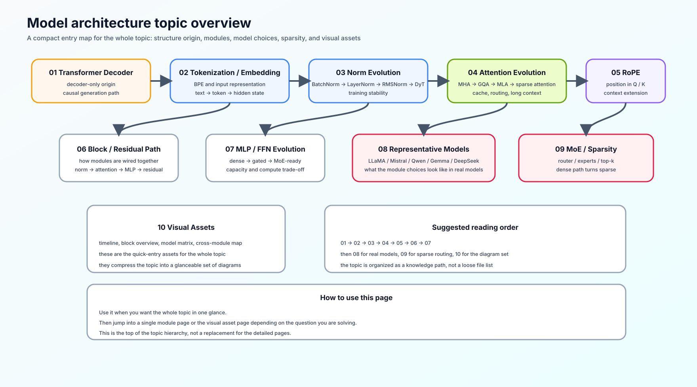
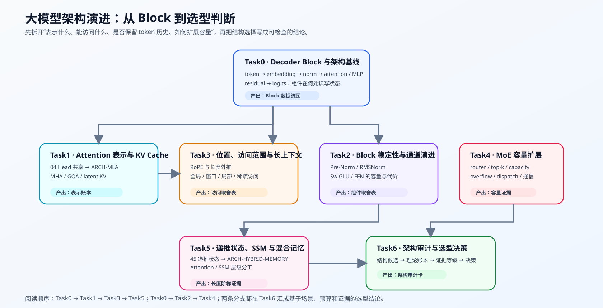
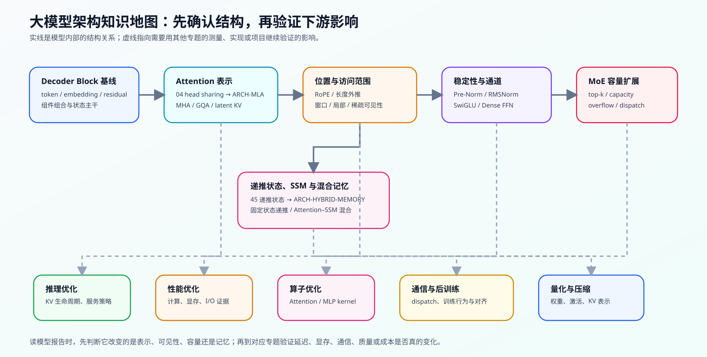

# 大模型架构演进（LLM Architecture Evolution）

> 专题类型：主学习路线　主服务目标：从结构选择看清模型的能力、资源代价与适用边界

## 页面导语

模型名称、参数规模和 benchmark 只能说明结果，不能解释结果从哪里来。要读懂一份模型报告，需要把 token 如何进入 Decoder Block、上下文如何被访问、位置如何编码、FFN 如何扩展，以及何时用稀疏或递推状态连成同一条结构链。

本专题不把结构改动直接等同于性能收益。它先回答“结构为何这样设计”，再把可测的计算、显存、通信与服务影响交给推理优化、性能优化和算子优化专题验证。

## 如何开始

- **第一次学习：** 从 Task0 开始，沿输入表示、Block 主干和组件职责建立 Decoder-only 模型的整体视野。
- **想理解 Attention 与长上下文：** 依次进入 Task1、Task3、Task5：先看 KV 如何表示，再看哪些历史 token 可访问，最后比较显式历史与递推状态。
- **想读 MoE 或前沿报告：** 完成 Task2 后进入 Task4；需要比较不同记忆架构时补 Task5，最后用 Task6 的审计表比较真实模型。
- **已有具体模型要分析：** 先看 Task6 的结构审计方法，再按缺失组件回补相应 Task。

路线图把学习顺序、问题和验证产物放在一张图里；知识地图说明各类结构选择会影响哪些下游主题。

## 主学习路线与验证出口

| Task / 主题 | 本阶段要回答的问题 | 学习入口与验证出口 | 学习顺序 | 专题正文入口 |
|:---|:---|:---|:---|:---|
| Task0 · Decoder Block 与架构基线 | token 怎样成为 hidden state，并沿 Decoder Block 主干传递？ | [01 Transformer Decoder](./01_transformer_decoder.md) → [02 Tokenization / Embedding](./02_tokenization_embedding.md) → [06 Block / Residual](./06_block_residual_path.md)；前置：[Part 00 · 02 NumPy / Einsum](../../00_Prerequisites/02_NumPy_and_Einsum.ipynb)、[16 Attention 入门](../../00_Prerequisites/16_Attention_Mechanism_Intro.ipynb)；代码：[Part 02 · 00 PyTorch Warmup](../../02_PyTorch_Algorithms/00_PyTorch_Warmup.ipynb) → [05 LLaMA3 Block](../../02_PyTorch_Algorithms/05_LLaMA3_Block_Tutorial.ipynb) | 先画出 `token → embedding → norm → attention / MLP → residual → logits`，再看组件细节 | [01 Decoder-only 模型](./01_transformer_decoder.md) |
| Task1 · Attention 表示、KV Cache 与头部共享 | Q/K/V 按什么粒度保存，MHA、MQA、GQA、MLA 怎样改变状态大小？ | [04 Attention 演进](./04_attention_evolution.md)；前置：[Part 00 · 16 Attention 入门](../../00_Prerequisites/16_Attention_Mechanism_Intro.ipynb)、[Part 01 · 11 KV Cache 增长](../../01_Hardware_Math_and_Systems/11_KV_Cache_and_Memory_Growth.ipynb)；机制：[Part 02 · 04 MHA / GQA](../../02_PyTorch_Algorithms/04_Attention_MHA_GQA.ipynb) → [ARCH-MLA](../../02_PyTorch_Algorithms/ARCH-MLA_Multihead_Latent_Attention.ipynb)；专项项目：[Part 02 · 71 MLA / KV Cache 结构基准](../../02_PyTorch_Algorithms/71_MLA_KV_Cache_Architecture_Benchmark.ipynb) | MHA → MQA / GQA → MLA；先验证表示账本，再进入真实模型与 backend 证据 | [04 Attention 演进](./04_attention_evolution.md) |
| Task2 · Block 稳定性与通道演进 | 为什么 Pre-Norm、RMSNorm 和门控 FFN 会改变深层训练与表达？ | [03 归一化演进](./03_norm_evolution.md) → [07 MLP / FFN 演进](./07_mlp_ffn_evolution.md)；前置：[Part 00 · 14 激活函数](../../00_Prerequisites/14_Activation_Functions.ipynb)、[15 归一化技术](../../00_Prerequisites/15_Normalization_Techniques.ipynb)；代码：[Part 02 · 01 RMSNorm](../../02_PyTorch_Algorithms/01_RMSNorm_Tutorial.ipynb) → [02 SwiGLU](../../02_PyTorch_Algorithms/02_SwiGLU_Activation.ipynb)；专项基准：[Part 02 · 60 Decoder Block 稳定性](../../02_PyTorch_Algorithms/60_Decoder_Block_Stability_Benchmark.ipynb) | 归一化位置与尺度 → 门控通道变换 → Dense FFN 的容量代价 → 匹配 checkpoint 的质量—成本复测 | [03 归一化演进](./03_norm_evolution.md) |
| Task3 · 位置、访问范围与长上下文 | 位置怎样进入 Q/K；在仍保存 token 级历史时，哪些历史 token 可以被访问？ | [05 RoPE 与位置编码](./05_rope_position_encoding.md)；前置：[Part 00 · 16 Attention / mask](../../00_Prerequisites/16_Attention_Mechanism_Intro.ipynb)、[Part 01 · 25 稀疏 Attention](../../01_Hardware_Math_and_Systems/25_Sparse_Computation_and_Sparse_Attention.ipynb)；代码：[Part 02 · 03 RoPE](../../02_PyTorch_Algorithms/03_RoPE_Tutorial.ipynb) → [44 局部、窗口与稀疏 Attention](../../02_PyTorch_Algorithms/44_Local_Sliding_and_Sparse_Attention.ipynb)；专项基准：[Part 02 · 78 Attention 访问模式](../../02_PyTorch_Algorithms/78_Attention_Access_Pattern_Benchmark.ipynb)；扩展：[Part 01 · 04 Attention 显存优化](../../01_Hardware_Math_and_Systems/04_Attention_Memory_Optimization.ipynb)、[11 KV Cache 增长](../../01_Hardware_Math_and_Systems/11_KV_Cache_and_Memory_Growth.ipynb)、[14 FlashAttention 显存模型](../../01_Hardware_Math_and_Systems/14_FlashAttention_Memory_Model.ipynb) | 位置表示 → RoPE 相对关系 → 全局 / 窗口 / 局部 / 稀疏访问 → mask 覆盖与成本证据 → 长度与信息取舍 | [05 RoPE 与位置编码](./05_rope_position_encoding.md) |
| Task4 · MoE 容量扩展与稀疏化 | 如何扩大总参数量，同时限制每个 token 的激活计算、容量溢出与跨卡代价？ | [09 MoE 与稀疏化](./09_moe_sparsity_evolution.md)；前置：[Part 01 · 22 MoE 参数与计算](../../01_Hardware_Math_and_Systems/22_MoE_Parameter_and_Compute.ipynb)；代码：[Part 02 · 06 MoE Router](../../02_PyTorch_Algorithms/06_MoE_Router.ipynb) → [07 负载均衡](../../02_PyTorch_Algorithms/07_MoE_Load_Balancing_Loss.ipynb)；专项项目：[Part 02 · 80 MoE 专家并行基准](../../02_PyTorch_Algorithms/80_MoE_Expert_Parallel_Benchmark.ipynb)；扩展：[Part 01 · 25 稀疏计算](../../01_Hardware_Math_and_Systems/25_Sparse_Computation_and_Sparse_Attention.ipynb) | Router → Top-k → capacity / overflow → dispatch → 负载均衡与通信 | [09 MoE 与稀疏化](./09_moe_sparsity_evolution.md) |
| Task5 · 递推状态、SSM 与混合记忆 | 如果不保存完整 token 级 KV 历史，固定大小状态怎样递推；何时与 Attention 混合？ | [10 线性 Attention、SSM 与混合记忆](./10_linear_attention_ssm_and_hybrid.md)；机制：[Part 02 · 45 线性 Attention](../../02_PyTorch_Algorithms/45_Linear_Attention_and_Recurrent_State.ipynb) → [ARCH-HYBRID-MEMORY](../../02_PyTorch_Algorithms/ARCH-HYBRID-MEMORY_Attention_SSM_Hybrid.ipynb)；专项项目：[Part 02 · 77 长序列记忆架构基准](../../02_PyTorch_Algorithms/77_Long_Sequence_Memory_Architecture_Benchmark.ipynb) | 显式历史 → 递推状态 → SSM 选择性更新 → Attention / SSM 层级分工 → 长度阶梯证据 | [10 线性 Attention、SSM 与混合记忆](./10_linear_attention_ssm_and_hybrid.md) |
| Task6 · 架构审计与选型决策 | 如何基于场景、预算和证据判断一个新模型的创新、代价与适用条件？ | [08 代表模型与结构对照](./08_representative_models.md) → [Casebook](./casebook.md)；账本前置：[Part 01 · 02 参数与 FLOPs](../../01_Hardware_Math_and_Systems/02_LLM_Params_and_FLOPs.ipynb)、[22 MoE 参数与计算](../../01_Hardware_Math_and_Systems/22_MoE_Parameter_and_Compute.ipynb)；项目：[Part 02 · 61 模型架构探索](../../02_PyTorch_Algorithms/61_Model_Architecture_Exploration.ipynb) | 配置字段 → 单变量候选 → 资源影响 → 证据等级 → 采用 / 继续验证 / 不采用 | [08 代表模型与结构对照](./08_representative_models.md) |

## 正文、代码与当前建设重点

| 结构链 | 专题正文 | 可运行入口 | 当前建设状态 |
|:---|:---|:---|:---|
| 输入与 Block 主干 | 01、02、06 | Part 02 · 00、05 | 已有正文；正在加强 Block 组合机制与题目实现 |
| Attention 表示与 KV Cache | 04 | Part 02 · 04、ARCH-MLA、71 | 04 覆盖 head sharing；ARCH-MLA 建立 latent / RoPE 状态机制，并用单卡受控实验记录缓存字节与重建代价；71 承接真实模型和 backend 证据 |
| 位置与访问范围 | 05 | Part 02 · 03、44、78 | 03 与 44 说明位置和访问规则；78 在统一 mask 账本下记录覆盖、连接数与 GPU 探针证据 |
| 稳定性与 MLP | 03、07 | Part 02 · 01、02 | 已有正文；继续加强 Norm / 激活的结构取舍 |
| MoE 稀疏化 | 09 | Part 02 · 06、07、80 | 06/07 建立 Router 与均衡机制；80 承接 capacity、dispatch 与通信证据 |
| 递推状态与混合架构 | 10 | Part 02 · 45、ARCH-HYBRID-MEMORY、77 | 45 建立线性递推基础并比较单层状态增长；ARCH-HYBRID-MEMORY 比较多层混合计划；77 收集真实 checkpoint 的质量与成本证据 |
| 模型结构审计 | 08、Casebook、Walkthrough | Part 02 · 61 | 61 用单变量结构候选、理论账本和证据等级生成审计卡 |

## 按需回补与跨专题连接

| 需要解释的现象 | 架构专题先回答什么 | 再进入哪个专题 |
|:---|:---|:---|
| KV Cache 太大或 Attention 访问范围变了 | Task1 解释 KV 表示；Task3 解释历史 token 的可访问范围 | [推理优化](../inference_optimization/intro.md) 的 Task1 / Task3 |
| Block、MoE 或长上下文变慢 | 结构中哪些计算与状态被引入 | [性能优化](../performance_optimization/intro.md) 与[算子优化](../operator_optimization/intro.md) |
| MoE 负载、专家通信或扩展效率异常 | 路由、capacity 与 dispatch 的结构含义 | [通信与并行](../communication_parallelism/intro.md) |
| 模型需要微调、对齐或改造行为 | Block 与专家结构为训练提供什么底座 | [后训练优化](../post_training_optimization/intro.md) |
| 需要降低模型表示成本 | 哪些权重、激活或 KV 表示可被改变 | [量化与压缩](../quantization_compression/intro.md) |

同一个概念可以在多个专题出现，但结论必须分开。例如，MLA 在这里是 KV 表示的架构选择；在推理优化中是 Cache 生命周期的一部分；在性能优化中需要以显存、延迟和吞吐证据判断收益。

## Casebook 与问题链

- 想从“一个模型配置或论文结论是否可信”进入，阅读[架构审计 Casebook](./casebook.md)。
- 想按“输入 → Block → Attention 表示 → 位置 / 访问 → 稀疏或递推状态 → 模型审计”连续学习，阅读[架构演进问题链](./walkthrough.md)。

## 项目职责

本专题的项目顺序使用稳定语义 ID 表达：`ARCH-BLOCK-STABILITY → ARCH-ATTENTION-ACCESS → ARCH-MLA-KV → ARCH-LONG-SEQUENCE-MEMORY → ARCH-MODEL-AUDIT`。其中 60、78、71、77 分别提供 Block、访问范围、KV 表示和长序列记忆证据，61 只负责汇总审计；80 是通信与并行主归属的交叉证据，不进入本专题主项目链。

| 项目 | 在架构专题中的职责 | 不承担的结论 |
|:---|:---|:---|
| [61 模型架构探索](../../02_PyTorch_Algorithms/61_Model_Architecture_Exploration.ipynb) | Task6 主项目：把单变量结构候选、理论账本与证据等级汇成架构审计卡 | 不替代单个组件的机制推导或长序列质量 benchmark |
| [71 MLA / KV Cache 结构基准](../../02_PyTorch_Algorithms/71_MLA_KV_Cache_Architecture_Benchmark.ipynb) | Task1 专项项目：比较 MHA、GQA、MLA 的 KV 表示与理论容量 | CPU 账本不推出真实 backend 延迟或任务质量 |
| [80 MoE 专家并行基准](../../02_PyTorch_Algorithms/80_MoE_Expert_Parallel_Benchmark.ipynb) | Task4 专项项目：将 router、capacity、overflow 与 dispatch 接到多卡证据 | 合成 dispatch 探针不替代真实 MoE backend 训练或推理结果 |
| [77 长序列记忆架构基准](../../02_PyTorch_Algorithms/77_Long_Sequence_Memory_Architecture_Benchmark.ipynb) | Task5 专项项目：在固定长度阶梯比较显式 KV、递推状态与混合架构的质量和成本 | 跨模型观察结果不能直接归因于单一架构改动 |
| [78 Attention 访问模式基准](../../02_PyTorch_Algorithms/78_Attention_Access_Pattern_Benchmark.ipynb) | Task3 专项项目：比较全局、窗口、块稀疏与选择性稀疏访问的覆盖与连接账本 | 通用 SDPA mask 探针不等同于专用稀疏 kernel 基准 |

## 环境与验证

大多数结构机制可先在 CPU 上验证形状、状态和不变量；真实模型权重、长上下文质量、MoE 通信和端到端吞吐需要 GPU 或对应 backend。结构报告至少记录模型版本、配置来源、上下文长度、dtype、硬件和所用测量方式，并区分理论估算、机制测试与真实 benchmark。

GPU 实验先用 Transformers 固定 tokenizer、输入与模型语义，再按证据目标选择执行栈。vLLM 作为 GPU Serving 主基线，SGLang 只做相同模型、输入和生成条件下的 backend 对照；GGUF 使用 llama.cpp 的本地或端侧路径；TensorRT-LLM 只有在 NVIDIA Engine、插件与版本矩阵明确后才进入候选。Block 训练稳定性和 SDPA 访问机制仍以 PyTorch 为主，不为使用 Serving 引擎而强行切换执行路径。

| 实验目标 | 首选执行栈 | 进入下一层的条件 |
|:---|:---|:---|
| 配置、tokenizer 与输出语义 | Transformers | 固定 model/tokenizer revision、输入 token 与生成参数 |
| Block、状态和 mask 机制 | PyTorch / Transformers | 机制不变量通过，GPU smoke 无 failure |
| GPU Serving 基线 | vLLM | 模型结构与 backend 能力均受支持 |
| 同口径 Serving 对照 | SGLang | 与 vLLM 使用相同模型、workload、硬件与输出约束 |
| GGUF、本地与端侧 | llama.cpp | 单独登记 GGUF 元数据、线程和 offload 条件 |
| NVIDIA 专用 Engine | TensorRT-LLM | 固定 Engine、插件、TensorRT/CUDA 与目标 GPU |

各页不维护工具版本号；模型角色、能力 profile、环境隔离、预检和 runtime snapshot 统一见[模型、执行栈与环境资产表](../../docs/gpu_environment_assets.md)。

## 相关阅读

- [Attention Is All You Need](https://arxiv.org/abs/1706.03762)：Transformer 的注意力与 Decoder 基础。
- [LLaMA: Open and Efficient Foundation Language Models](https://arxiv.org/abs/2302.13971)：Pre-Norm、RMSNorm、SwiGLU 和 RoPE 的代表组合。
- [DeepSeek-V2](https://arxiv.org/abs/2405.04434)：MLA 与 DeepSeekMoE 的架构案例。
- [Mamba](https://arxiv.org/abs/2312.00752)：选择性状态空间模型的代表论文。
