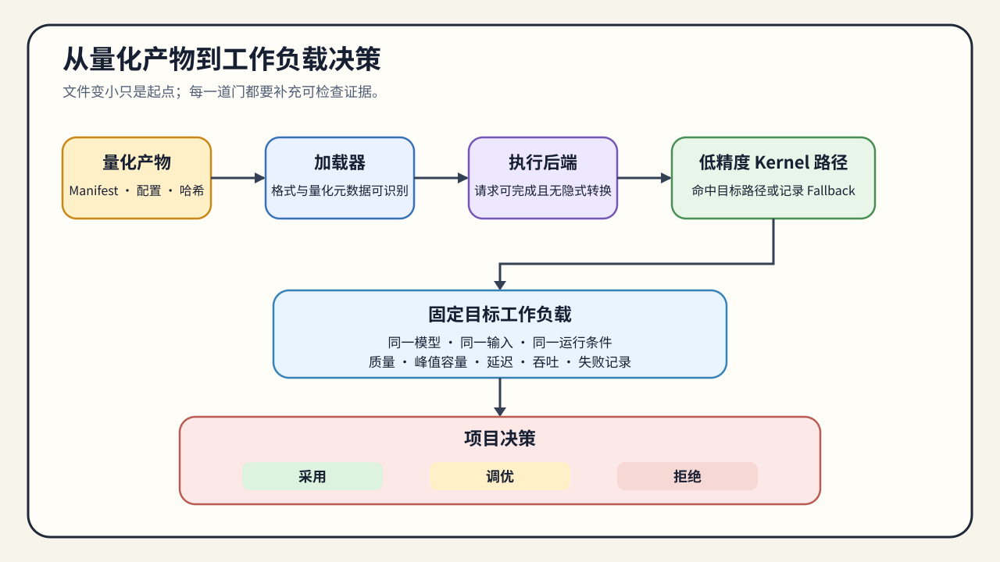

# 06. Artifact, Execution, and Workload Decision | 产物、执行与工作负载决策

## 本页目标与路线位置

本节承接 Task5–6，把前面产生的权重、激活、训练适配或 KV Cache 候选转化为可复测的工程决策。学习者需要确认 artifact 能否被目标系统接收、是否命中预期执行路径，以及质量和资源收益能否在固定 workload 下重复。

本节不重新解释量化算法。输出是一份带适用条件的 `accept / tune / reject` 结论，以及能够追溯该结论的 manifest、原始结果和失败记录。

## 核心机制

量化候选必须依次经过五个环节：

`artifact 可定位 → loader 可识别 → backend 可执行 → kernel / fallback 可确认 → workload 可比较`

### 从 Artifact 到执行路径

| 环节 | 需要回答的问题 | 最小证据 | 未通过时的处理 |
|:---|:---|:---|:---|
| Artifact | 文件、配置和来源能否追溯？ | model revision、quant config、manifest、hash | 回到候选生成或产物整理 |
| Loader | 目标加载器是否识别格式与元数据？ | loader/backend 版本、加载日志 | 记录兼容性失败，不能进入性能比较 |
| Backend | 请求是否由目标执行栈完成？ | backend 配置、硬件、运行日志 | 检查格式支持或更换执行路径 |
| Kernel | 是否命中预期低精度 kernel？ | dtype、kernel 或 profiler 证据、fallback | 不把文件缩小写成速度收益 |
| Workload | 质量、容量和性能是否达到目标？ | 固定输入、baseline/candidate、重复运行 | 根据失败项继续调优或拒绝候选 |

量化方法、数值格式、artifact 格式、backend 和 kernel 是五个不同字段。例如 GPTQ/AWQ 描述误差控制方法，INT4/FP8 描述表示，GGUF 描述文件格式；只有执行证据才能说明实际使用了哪条计算路径。

### 训练与推理使用不同证据

| Workload | 主要证据 | 不能替代的证据 |
|:---|:---|:---|
| 低比特训练 | 收敛、验证质量、峰值显存、step time、训练吞吐 | 推理 backend、TTFT、TPOT 与 Serving 吞吐 |
| 离线或在线推理 | 独立质量、加载与运行显存、延迟、吞吐、kernel/fallback | adapter 更新正确性和训练稳定性 |
| 性能归因 | 字节数、带宽、计算路径和端到端变化 | 未固定 workload 的局部计时或文件大小 |

训练适配产物通常是 adapter 或 merged model；推理量化产物包含面向 loader/backend 的量化权重与元数据。两者可以衔接，但必须经过显式转换和独立复测。

## 选择条件与验证证据

### 固定比较契约

baseline 与 candidate 使用同一模型来源、tokenizer、输入和运行条件，只改变明确登记的候选变量。

| 字段组 | 必须固定或记录的内容 |
|:---|:---|
| Artifact | model/revision、路径、量化方法、格式、配置、校准摘要、manifest |
| 执行环境 | hardware、驱动、PyTorch、loader、backend、kernel/fallback |
| Workload | prompt 或数据集、输入/输出长度、batch、并发、warmup、repeats、采样参数 |
| 结果 | 质量、显存、TTFT、TPOT、端到端延迟、吞吐、P95/P99、原始日志 |
| 决策 | baseline/candidate、质量门槛、资源预算、证据等级、失败原因 |

### 语义资产如何衔接

正文只规定需要消费的证据类型，不绑定项目编号。具体项目入口和当前承载页统一登记在专题 intro 的“项目出口与稳定 ID”表中。

| 语义资产 | 交付给下一阶段的证据 | 使用条件 |
|:---|:---|:---|
| 训练适配产物 | adapter / merged model、训练质量、转换记录 | PTQ 质量不足且需要训练适配时使用 |
| 量化产物清单 | manifest、校准/评测隔离、质量门槛、加载器兼容性 | 通过后才能进入同口径性能比较 |
| 浮点基线 | 固定工作负载、执行后端、运行环境和原始结果 | 为量化候选提供相同条件的参照 |
| 部署运行记录 | 格式元数据、Kernel/Fallback、资源与质量结果 | 形成可部署候选和初步决策 |
| 服务性能记录 | 延迟、吞吐与容量配置、尾延迟、失败记录 | 根据目标 SLO 选择最终配置 |

项目消费的是语义资产，不要求严格按编号执行。已有等价浮点 baseline 或通过 gate 的 artifact 时，可以直接复用，但必须保留来源、版本和 workload。

### 决策规则

| 决策 | 条件 | 下一步 |
|:---|:---|:---|
| `accept` | 质量和资源均达标，执行路径明确，重复运行方向一致 | 固化 artifact、配置和适用范围 |
| `tune` | 候选可运行，但校准、粒度、backend、workload 或重复证据不足 | 只调整一个变量后复测 |
| `reject` | 无法加载、质量低于门槛，或资源代价超过预算 | 回到候选生成或更换路线 |

最终报告应明确压缩对象、执行路径、质量变化、资源与性能变化、失败记录和适用范围。结论只对登记的模型、硬件、backend 和 workload 有效。

出现具体失败现象时使用[量化问题排查手册](./casebook.md)回查 01–05；候选进入异构设备或分层服务前，还应通过[部署与异构系统的 Runtime 兼容性检查](../deployment_heterogeneous/07_accelerator_runtime_compatibility.md)。
