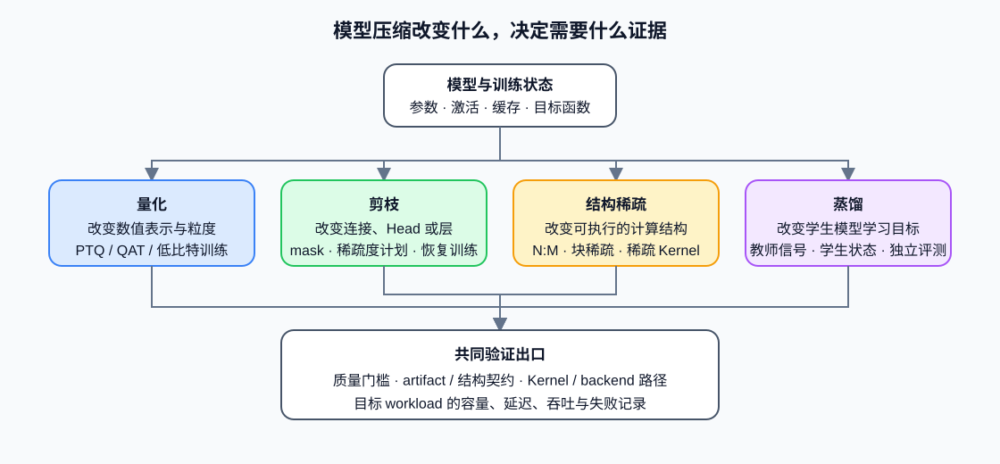

# 07. Pruning, Distillation, and Structured Sparsity | 剪枝、蒸馏与结构稀疏

## 本页目标与路线位置

量化改变数值表示，但不是唯一的模型压缩方法。剪枝改变参数或连接是否保留，结构稀疏改变可执行的计算结构，蒸馏则通过教师信号训练更小的学生模型。本页把三类扩展放进统一的“对象—训练状态—执行路径—质量证据”框架，帮助学习者判断下一步应进入后训练、算子优化还是部署验证。

本页是量化 Task0–6 之后的扩展入口，不新增 Task，也不把尚未建设的机制写成已完成课程。

## 核心机制

| 方法 | 主要改变对象 | 是否通常需要训练 | 理论收益首先体现在哪里 | 真正生效还需要什么 |
|:---|:---|:---|:---|:---|
| 量化 | 权重、激活、训练状态或 KV Cache 的数值表示 | PTQ 不需要；QAT/QLoRA 需要 | 每元素字节数、带宽与容量 | loader、低精度 Kernel 和 backend 支持 |
| 非结构化剪枝 | 单个权重或连接的 mask | 通常需要恢复训练 | 非零参数数量 | 稀疏存储与匹配的稀疏 Kernel；否则可能只增加索引开销 |
| 结构化剪枝 | Head、通道、神经元、层或 Block | 通常需要恢复训练 | 张量形状、参数量和 FLOPs | 导出后的形状必须被框架与 Kernel 正确接收 |
| 结构稀疏 | 满足 N:M、块稀疏等硬件友好约束的连接 | 常与剪枝/训练联合 | 可被硬件识别的稀疏计算量 | 目标 GPU、库和 Kernel 支持同一种稀疏模式 |
| 蒸馏 | 学生模型的函数、表示或输出分布 | 需要教师—学生训练 | 学生模型规模和目标能力 | 教师输出、数据、损失权重与独立评测协议 |

这些方法可以组合，但不能把收益相加。量化后的稀疏权重可能没有对应 Kernel；剪枝后的结构可能改变量化敏感度；蒸馏得到的小模型也需要重新校准，而不是继承教师模型的量化参数。

### 训练状态与产物

压缩实验必须说明哪些状态参与更新。量化 PTQ 主要维护校准统计和量化元数据；剪枝需要 mask、稀疏度计划与恢复训练状态；蒸馏还需要教师版本、学生版本、logits/hidden-state 对齐配置和蒸馏损失。恢复训练时继续记录 optimizer、scheduler、RNG、progress 与 validation state，不能只保存最终权重。

| 路径 | 必须保存的专属状态 | 主要产物 |
|:---|:---|:---|
| PTQ / QAT | 校准统计、scale、zero-point、粒度、敏感层或高精度回退 | 量化权重与 quantization config |
| 剪枝 / 结构稀疏 | mask、目标稀疏度、调度、结构变化与恢复 checkpoint | 稀疏权重或重构后的模型结构 |
| 蒸馏 | teacher/student revision、温度、损失权重、数据 manifest | 独立学生模型及训练报告 |

## 选择条件与验证证据

先按目标选择机制：容量或带宽受限时优先检查量化；模型本身过大且可重新训练时再考虑结构化剪枝或蒸馏；目标硬件明确支持稀疏 Kernel 时，结构稀疏才具有直接性能价值。非结构化稀疏率、参数量或理论 FLOPs 都不能单独证明端到端加速。

候选至少通过四类证据：固定评测集上的质量、artifact 与加载契约、目标 backend 的实际执行路径，以及同 workload 的内存和延迟/吞吐结果。缺少稀疏 Kernel 时，剪枝结果只能证明参数被置零；缺少独立学生评测时，蒸馏 loss 只能证明训练目标下降。

继续学习时，蒸馏训练进入[后训练优化](../post_training_optimization/intro.md)，稀疏 Kernel 与数据布局进入[算子优化](../operator_optimization/intro.md)，资源归因进入[性能优化](../performance_optimization/intro.md)，产物和设备兼容进入[部署与异构系统](../deployment_heterogeneous/intro.md)。
